<p align="center">
  
</p>

# CAST

[](https://github.com/ek33450505/claude-agent-team/actions/workflows/bats-ci.yml)


> **CAST v9 — "The record that acts."** Claude Code keeps a transcript. CAST keeps a **record** — a complete, local, inspectable SQLite trail (<!-- CAST_DB_TABLE_COUNT -->39<!-- /CAST_DB_TABLE_COUNT --> typed governance tables at `~/.claude/cast.db`) — and then *uses* it: it predicts your next dispatch, recalls the incident you're about to re-cause, attributes your spend per task, and gates your commits. A governance layer built entirely on Claude Code's native primitives — hooks, subagents, skills, permissions, MCP — with <!-- CAST_AGENT_COUNT -->22<!-- /CAST_AGENT_COUNT --> specialist agents that plan, implement, review, test, and commit. Raw `git commit` and `git push` are **hard-blocked** by hooks; every dispatch is recorded. **The record is the product.** Not the agents, not the prompts — the enforcement and the data sovereignty. Every agent failure, every code review, every truncation is captured and usable. The system is honest about its own limits.

**[CAST Framework](https://castframework.dev)** · *Keep using Anthropic's native tools. Own the record.*

CAST is the system I'd want if I were building production software with Claude Code every day — so I built it, broke it, and hardened it until it earned trust. The hard part wasn't wiring agents together; it was making the platform **honest** (it tells you when work is unverified) and **safe** (it cannot delete its own runtime). Those lessons came from real incidents: a full `~/.claude` wipe (twice) that took out colocated backups, a destructive BATS test that ran `rm -rf` from the repo root unguarded, silent hook failures that ate data without trace. Each incident became an invariant in code: backups live outside the failure domain (Litestream replication to `~/Library`, off the `~/.claude` blast radius); the wipe forensics canary runs from an isolated path so it survives what it detects; a PreToolUse command-guard makes `rm -rf ~/.claude` and `pkill` structurally impossible from an agent; every test runs in a temp HOME, never the real one; and when a hook fails, it records that failure in the `hook_failures` table instead of eating the error silently.

Where Claude Code ships a native primitive, CAST **adopts it and deletes the bespoke version** (language rules became on-demand skills; heavy planning yields to native plan mode for single-session work; the whole thing ships as a **native plugin**). Where the platform still has a gap, CAST fills it: a fresh-context `code-reviewer` gate (the Writer/Reviewer pattern, mandatory here), an honesty/verification doctrine (`DONE_WITH_CONCERNS`, a typed Handoff contract, a Pre-existing-Failure-Evidence rule), an **eval harness mined from real agent failures**, and — new in v9 — a record that reads back: `cast cost`, `cast predict`, `cast ask`, `cast feature`, and a read-only `cast mcp` server over the whole trail.

**Where the project is now:** v9.5 (2026-07-09) is the last release under that hardening push. From here CAST is in maintenance mode — bug fixes, the monthly audit, dependency/CI upkeep, and whatever the weekly record-review loop proposes and a human accepts. Full history: [CHANGELOG.md](CHANGELOG.md).

---

## Installation

### Homebrew

```bash
brew tap ek33450505/cast && brew install cast
```

### Manual install

```bash
git clone https://github.com/ek33450505/claude-agent-team.git
cd claude-agent-team
bash install.sh
```

### Install as a plugin

CAST ships as a native Claude Code plugin (**dual-ship** — the plugin coexists with `install.sh`, it does not replace it). Two ways to load it:

**From the marketplace (recommended):**
```bash
/plugin marketplace add ek33450505/claude-agent-team
/plugin install cast@cast
/plugin enable cast@cast
```

**From a local checkout:**
```bash
git clone https://github.com/ek33450505/claude-agent-team.git
claude --plugin-dir claude-agent-team/plugin
```

The plugin bundles CAST's curated agents, skills, commands, and `command`-type enforcement hooks. It is **opt-in** (`defaultEnabled: false`) — **until you run `/plugin enable cast@cast`, the SessionStart bootstrap does not run.** `install.sh` remains authoritative for the runtime layer (`~/.claude/scripts`, `cast.db`, launchd jobs, git hooks); when both are present, the plugin's hooks defer to install.sh via a `~/.claude/config/cast-hook-owner` sentinel so nothing double-fires.

> **Curated payload:** the plugin ships **17 lean agents**; the `push` agent (needs the install.sh runtime) and `morning-briefing` are excluded. Add the 3 opt-in extras (release-notes, api-contract, dep-auditor) by regenerating with `bash scripts/gen-plugin.sh --with-extras dist/cast-plugin` then `claude --plugin-dir dist/cast-plugin`. The full `install.sh` carries all <!-- CAST_AGENT_COUNT -->22<!-- /CAST_AGENT_COUNT --> agents.

---

## Quick Start

**[docs/tutorial/getting-started.md](docs/tutorial/getting-started.md)** — install, verify, and run `cast status` in 5 minutes.

---

## Why CAST

**The fundamental insight:** observability systems produce data, but data alone is powerless. The record only matters when it *acts* — when it changes the next decision. CAST inverts the typical observability stack: instead of "instrument → ship data → hope someone reads a dashboard," CAST implements "record → query → inject → enforce." Every dispatch, every code review, every truncation, every agent hallucination lands in a typed SQLite schema at `~/.claude/cast.db`. That record is not a logbook — it is the control plane.

**Enforcement that actually bites:**
- Raw `git commit` and `git push` are **hard-blocked** by PreToolUse hooks (`scripts/cast-git-guard.py`). No honor system, no flags you can ignore. Commits route through a `commit` agent that records provenance; a pre-push gate audits that every commit traces to a recorded session.
- Code changes mandate a fresh-context `code-reviewer` gate — you cannot merge without it. The mandatory Writer/Reviewer separation is enforced in the agent registry, not in your discipline.
- Destructive operations (`rm -rf` of tracked roots, `pkill` of protected processes) are blocked by a command-guard in PreToolUse, with path-tier specificity that native glob permissions cannot express.

**The system audits itself:**
- A `SubagentStop` hook runs on every agent completion, parsing the typed `## Handoff` contract, detecting truncations (agents cut off mid-task get flagged, not silently relayed as done), checking `claimed_work` against actual file changes via `cast_claimed_work_verifier.py`, and recording its findings in `agent_hallucinations` and `agent_truncations` tables. The system records *its own failures*.
- `cast doctor` surfaces the honest verdict: collected-but-unread observability tables (a 50-row `incidents` table with zero `cast ask` queries is NOT "all green"), fresh/stale backups, decoder/canary health, writable evidence paths. No false-green.

**Concrete capabilities:**
- **<!-- CAST_AGENT_COUNT -->22<!-- /CAST_AGENT_COUNT --> specialist agents** — `code-writer`, `code-reviewer`, `debugger`, `planner`, `test-writer`, `commit`, `push`, and 16 others. Each has a bounded scope and model tier (Haiku 4.5 / Sonnet / Opus). They don't cross lanes.
- **The record acts:** `cast predict` joins past outcomes to agent cost/success rates; `cast ask` runs full-text search over the whole record; `cast cost --by-task` attributes spend per unit of work; the pre-push gate reads `quality_gates` to enforce review.
- **Local-first by construction.** Your code, prompts, memory, and the full audit trail live on your disk. No SaaS dashboard, no telemetry egress, no sign-in. Every cloud feature is strictly opt-in — a CAST user with no network still has a fully working system.
- **Agent behavior is tested, not hoped for.** The `cast eval` harness runs an agent-behavior corpus mined from real failures — with LLM-judge graders and `pass@k`.
- **<!-- CAST_TEST_COUNT -->2338<!-- /CAST_TEST_COUNT --> BATS test cases** proving the guards work — including tests that *prove destructive ops refuse*. Runs on macOS and Ubuntu.

---

## The v9 Thesis: The Record That Acts

CAST's organizing principle is convergence: **retire custom code wherever Claude Code now ships a native primitive, and keep only what the platform still lacks.** v8 acted on it — language rules became demand-loaded skills, the mandatory planner chain softened to native plan mode, distribution moved to a native plugin. The flagship came out *smaller*.

v9 answers the next question: *what is left when you subtract everything native can do?* The answer is the **record** — not as a logbook you read after the fact, but as a live input to the next decision. CAST has audited itself adversarially and publishes the verdict: most of the framework honestly **melts into native**, and the thin, genuine residual is the governance-semantic content of the record, its cross-surface joins, and the honesty doctrine rendered *executable*. See [The convergence floor](#the-convergence-floor-whats-cast-forever-what-honestly-melts) and [docs/architecture/ARCHITECTURE.md](docs/architecture/ARCHITECTURE.md).

---

## Pillar 1 — Local-First by Construction

The core loop never requires leaving the machine. Observability is local SQLite (`cast.db`); memory is local files + a local FTS5 index; enforcement is local hooks. Every cloud capability is an *additive convenience*, clearly labelled and never a dependency:

- **Managed Agents** (`--cloud`) — dispatch parallel agents on Anthropic infrastructure instead of git worktrees. Opt-in.
- **Cross-LLM routing** — route Haiku-tier work to a local Ollama model via [claude-code-router](https://github.com/musistudio/claude-code-router) (`ccr`). Opt-in, per session.

A CAST user with no network still has a fully working system. *Design rule: no feature may make the core dev loop depend on a remote service — if it would, it ships as an opt-in track.*

---

## Pillar 2 — Data Integrity by Construction

The thing that bit me repeatedly (full `~/.claude` wipes) is now a headline guarantee. Hard-won lessons made into invariants:

- **Backups live outside the failure domain.** [Litestream](docs/backups.md) replicates `cast.db` continuously to `~/Library/Application Support/cast/` (off the `~/.claude` blast radius); dated snapshots land there too. The colocated `~/.claude/backups` that died with its host is gone.
- **The detector survives the blast radius.** The wipe canary runs from `~/Library/.../cast/bin/`, so it captures forensics the instant `~/.claude` vanishes — the detector can't be deleted by the event it detects.
- **CAST cannot destroy its own runtime.** Write-guards block writes outside a declared blast radius; a PreToolUse **command-guard** blocks `pkill`/`killall` and `rm -rf` of protected roots; a `blast-radius-lint` ratchet fails CI on any bare `rm -rf` in `scripts/`; teardown guards isolate every test to a temp HOME.
- **Destructive ops are tested by proving refusal**, not just success. Schema migrations and prune jobs back up fail-closed before they touch data (`cast-migrate.py --confirm`).

`cast integrity` is the read surface — one honest command answering "are my guards live, backups fresh and off-radius, canary loaded, evidence path writable, *right now*?" — and a daily monitor notifies only when something regresses. Full design: [docs/backups.md](docs/backups.md).

---

## The record that acts

Most observability is write-only. You instrument a system, ship telemetry to a dashboard, and the data dies in a panel nobody queries. CAST closes that loop. The same SQLite store at `~/.claude/cast.db` that *records* a dispatch also *reads back* on the next one:

- **`cast predict`** joins past `dispatch_decisions` outcomes to per-agent success rates and per-session cost — "you've routed work like this before; here's how it went."
- **`cast ask`** runs FTS5 over the whole record so a failure mode caught once (an `incidents` row) becomes a guardrail forever.
- **`cast cost --by-task`/`--by-branch`/`--by-agent`** attributes tokens and dollars to a unit of work.
- The **commit gate** reads `quality_gates` to decide whether a change has actually been reviewed.

The native primitive underneath is **hooks**. Claude Code fires structured JSON on `SessionStart`, `UserPromptSubmit`, `PreToolUse`, `PostToolUse`, `SubagentStop`, and `Stop`; CAST wires each as a recorder that writes a typed row, and wires `UserPromptSubmit` as the *injection* path that feeds prior rows back into the next turn. Record → query → inject → influence is exactly what hooks are for.

CAST is honest about this: the hooks-as-recorders mechanism is native plumbing — a community plugin could subscribe to the same events. What a generic plugin *cannot* produce is the **content**. `dispatch_decisions`, `provenance_chain`, `quality_gates`, `injection_log`, `incidents` — these rows don't exist in vanilla Claude Code because the *events* don't exist there. They are the exhaust of CAST's governance architecture. A record is only as rich as the events its host emits.

As of v9.5, the record reads back on itself, not just on the next dispatch. A weekly routine (`cast-record-review.py`, read-only `mode=ro` against `cast.db`) mines `agent_runs`, `agent_hallucinations`, `agent_protocol_violations`, and hatch-event logs into a proposals report — cost-per-success by agent×model, truncation rates worth a `maxTurns` change, recurring hallucinations worth an eval case, friction that looks like a false guard block. A human approves or rejects each line; nothing acts automatically. The first report, run the day it shipped, produced 32 proposals from real data and caught its own measurement bug in the process (an alias vs. resolved-model-ID mismatch it flagged before recommending against acting on it) — two proposals were accepted and shipped the same day.

---

## Proven economics — with the honest attribution

Over **2026-06-12 to 2026-06-30, across 4,762 recorded runs**, CAST's `agent_runs` table shows an **~86.6% cache-read share** of input-side tokens. Valued against re-sending the same context fresh (a cache read bills at 0.1× base input), that is **~$7,920 avoided** — Sonnet $3,863, Opus $3,010, Haiku $1,047 — computed from recorded token counts times verified live prices. It is an attributable *floor*: it excludes off-policy and legacy-alias rows whose cache reads were never recorded, so the true figure is somewhat higher but not data-backed.

Here is the part most portfolios would hide: **CAST does not create that saving.** Prompt caching is an automatic *platform* feature; vanilla Claude Code gets it with zero CAST involvement. The figure is also a counterfactual (cost-vs-resending), not cash in a bank account.

What CAST *actually* contributes is narrower and real:

1. **Legibility.** `cast cost` turns an opaque platform discount into an attributable, auditable number. The measurement is the CAST product.
2. **Session shape.** Slim always-on rules (~100–420 tokens reclaimed per session) plus demand-loaded **skills** plus stable memory injection engineer a larger, stabler cacheable prefix so the platform's caching works harder. Real, but unquantified — no controlled baseline isolates CAST-shaped cache hits from hits that would have happened anyway.

The recorded **model tiering** shows the discipline directly: Haiku does the most runs (1,327) at the least cost ($281); Opus does the fewest canonical runs (658) at the most ($4,524) — roughly three-quarters of recorded canonical model spend concentrated where it buys correctness on the hardest reasoning. Tiering keeps over a thousand review-class runs off the Opus tier. See [docs/TOKEN-OPTIMIZATION.md](docs/TOKEN-OPTIMIZATION.md).

---

## The convergence floor: what's CAST-forever, what honestly melts

The subtraction thesis, turned on CAST itself: when Claude Code ships a native equivalent, adopt it and delete the bespoke code. CAST has run that audit adversarially and reports the verdict plainly — because honesty about what melts is the pitch.

**Melts into native** (and CAST says so): demand-loaded skills (<!-- CAST_SKILL_COUNT -->17<!-- /CAST_SKILL_COUNT --> SKILL.md dirs, 100% native loader), the MCP adapter, the agent roster + model tiering (<!-- CAST_AGENT_COUNT -->22<!-- /CAST_AGENT_COUNT --> agents, all native frontmatter), `cast feature` (a native Workflow), the statusline, backup/DR (already delegated to Litestream continuous replication, with off-the-shelf snapshot tooling for the rest), the provenance chain's tamper-evidence (git is the canonical Merkle chain). Each is content or convenience over a native seam.

**CAST-forever** — the thin, genuine residual: the **governance-semantic content** of the record and its **cross-surface joins**. No single off-the-shelf plugin gives you `dispatch_decisions` outcomes joined to per-agent cost, per-session spend, and incident recall in *one* sovereign schema, because producing those events means reimplementing CAST's governance — at which point the plugin *is* CAST. And the honesty constraint rendered *executable*: write-guards that inspect a file's body to block a README whose stat badge contradicts the real repo, and path-tier `rm` specificity that native glob permissions can't express.

A system honest about its own convergence floor is a system you can trust about everything else — including the $7,920.

---

## Documentation

| Guide | Description |
|---|---|
| [Tutorial](docs/tutorial/getting-started.md) | Install CAST and run your first agent dispatch |
| [Architecture](docs/architecture/ARCHITECTURE.md) | The control plane, enforcement, data-integrity stack, evals |
| [Backups & Recovery](docs/backups.md) | Litestream, off-radius snapshots, `cast integrity` |
| [Hook Authoring Guide](docs/hooks/authoring-guide.md) | Write, test, and install custom hook scripts |
| [Compatibility Matrix](docs/compatibility.md) | Claude Code version requirements and known breakages |
| [Full Docs Index](docs/README.md) | All documentation with one-line descriptions |

---

## Sovereignty by construction

Because every recorder writes to a local file and nothing phones home, data sovereignty is structural, not promised. The record lives on your machine, in an open format, queryable with `sqlite3` or `cast ask`. CAST even serves it back through the open **MCP** protocol — `cast mcp serve` is a read-only stdio server (Python stdlib, no SDK, `mode=ro`, no arbitrary SQL) you register with `claude mcp add cast-record -- cast mcp serve`. Any Claude Code session, dashboard, or teammate can then ask the record "what did we decide / what broke / what did it cost" without bespoke plumbing. CAST is candid that the MCP *adapter* melts: Anthropic's own reference SQLite MCP server could expose `cast.db` too. The irreducible part isn't the server — it's the curated, cross-surface content the server has to serve.

---

## Your First Workflow

CAST matches planning ceremony to task size:

1. **Trivial** (a typo, a one-value tweak) — just make the change. (Code still routes to a specialist; "no plan" never means "no review.")
2. **Single-session** (one or a few files) — native plan mode (shift-tab), single agent. The default for ordinary work.
3. **Multi-file / multi-agent** — `/plan add user auth feature` → the `planner`→`/orchestrate` chain writes an Agent Dispatch Manifest and runs it in waves.

Then **execute** — code-writer implements, code-reviewer checks (**mandatory**, fresh context), test-runner verifies, the commit agent stages — and **ship** (`/ship` → tests, CI sanity, push, journal entry). To build a whole feature end-to-end under the gates, `cast feature "<description>"` decomposes it into gated units across the stack and runs them with the writer/reviewer discipline.

---

## Architecture

Every CAST operation follows the same gated pipeline: a user prompt is routed by `CLAUDE.md`; **PreToolUse guards** (write-guard, command-guard, commit-guard) block non-compliant actions before they land; the **typed agent registry** dispatches to the right model tier; a **mandatory `code-reviewer` gate** reviews code in fresh context; the **SubagentStop** hook validates the typed Handoff, runs honesty sensors, and writes memory; and every step is appended to the local `cast.db` — which Litestream replicates *outside* the blast radius. Full guide: [docs/architecture/ARCHITECTURE.md](docs/architecture/ARCHITECTURE.md).

<p align="center">
  
</p>

---

## Agents

<!-- CAST_AGENT_COUNT -->22<!-- /CAST_AGENT_COUNT --> core specialists, each a markdown file in `~/.claude/agents/` with YAML frontmatter defining model tier, memory, isolation, and effort. Agent responses validate against JSON schemas in `schemas/` (including the typed `## Handoff` contract). The plugin curates **17 lean agents** for distribution (+3 opt-in extras); the full `install.sh` carries all <!-- CAST_AGENT_COUNT -->22<!-- /CAST_AGENT_COUNT -->. See [docs/agents/AGENT-ROSTER.md](docs/agents/AGENT-ROSTER.md) for the full table with model tiers.

Key agents: `code-writer`, `debugger`, `planner`, `researcher`, `security`, `code-reviewer`, `commit`, `push`, `test-writer`, `devops`, `bash-specialist`, `migration-reviewer`, `eval-writer`, `pr-reviewer`.

---

## Hooks

Deterministic `command`-type hooks enforce; `prompt`-type hooks are advisory. The lifecycle: **SessionStart** (bootstrap + context banner), **UserPromptSubmit** (memory recall + routing), **PreToolUse:Bash** (commit/push/stash block + the `pkill`/`rm -rf` command-guard), **PreToolUse:Write|Edit** (write-guards + reviewer injection), **PostToolUse**, **SubagentStop** (truncation detection + typed Handoff validation + honesty sensors + memory write), **PostCompact**, **SessionEnd** (memory distiller). See [docs/hooks/authoring-guide.md](docs/hooks/authoring-guide.md).

---

## Eval Harness

CAST has thousands of BATS *script* tests but, before v8, zero agent-*behavior* evals — the largest documented gap versus Anthropic's guidance. `cast eval` closes it: a corpus in `evals/cases/<agent>/*.yaml` mined from real failures (missed bugs, false `DONE`s, ignored scope), three-outcome graders (a grader that can't decide never false-fails), an LLM-judge grader, and `pass@k` for probabilistic behavior. Runs land in the `eval_runs` table.

```bash
cast eval list                 # available cases
cast eval run --all            # run the corpus
cast eval report               # latest verdict per case
```

---

## Observability & cast.db

SQLite (WAL mode) at `~/.claude/cast.db` — append-only, never truncated, **fully local**. <!-- CAST_DB_TABLE_COUNT -->39<!-- /CAST_DB_TABLE_COUNT --> typed governance tables store sessions, agent_runs, routing_events, quality_gates, dispatch_decisions, agent_memories, eval_runs, incidents, provenance_chain, and more. Query it three ways: `sqlite3` directly, `cast ask` (FTS5 over the whole record), or the read-only `cast mcp serve` MCP server. Surfaced by two read-only dashboards:

**[claude-code-dashboard](https://github.com/ek33450505/claude-code-dashboard)** — React 19 + Vite + Express, ~21 views (sessions, agent analytics & reliability, hook health, memory browser, plans, incidents, file-write audits, a SQLite explorer). **[Cast Desktop](https://github.com/ek33450505/cast-desktop)** — Tauri 2 native macOS app with an embedded PTY terminal, command palette, and 11 views. Both read `cast.db` locally — no cloud. See [docs/observability/OBSERVABILITY.md](docs/observability/OBSERVABILITY.md).

---

## Agent Memory & Persistence

Each agent accumulates domain knowledge in `~/.claude/agent-memory-local/<name>/MEMORY.md` (Tier 1, native auto-load) alongside a dynamic per-prompt router over the `agent_memories` table (Tier 2, FTS5 relevance + confidence scoring). Language conventions load on demand as skills. See [the architecture guide](docs/architecture/ARCHITECTURE.md#memory-pipeline). A weekly `com.cast.memory-consolidate` routine (Sundays 05:30) decays, dedups, archives, and promotes Tier 2 memories — confidence-gated and, since v9.5, usage-aware (a memory injected often decays slower than one nobody's recalled) rather than age-only.

---

## Routines: Scheduled Workflows

Time- and event-triggered agent jobs — daily briefings, inbox triage, standup, weekly cost reports, the daily `cast integrity` monitor, and more. Manage with `cast routines list` / `cast routines trigger <name>`. Full guide: [docs/routines.md](docs/routines.md).

Not every routine is YAML-defined — two run as direct launchd jobs outside that schema: the weekly memory-consolidation pass (`com.cast.memory-consolidate`, Sundays 05:30) and the weekly record-review loop (`com.cast.record-review`, Sundays 07:00). See [CHANGELOG.md](CHANGELOG.md#950--2026-07-09--the-record-runs-the-system).

---

## Token Efficiency & Cost Optimization

Since v9.5, the main-loop model defaults to `claude-sonnet-5` ($2/$10 per million tokens against Opus 4.8's $15/$75) — because Workflow, Explore, Plan, and general-purpose subagents inherit whatever model is driving the main loop, this one setting moved the framework's largest recorded cost driver (`workflow-subagent`, 64.6% of agent spend, ~69% Opus-by-inheritance) off Opus by default. See [docs/agents/AGENT-ROSTER.md](docs/agents/AGENT-ROSTER.md) for the escalation path (`/model opus`, `/model fable`) and its one sharp edge (a Fable main loop that fans out spawns Fable subagents).

Model tiering, response budgets, optional local Ollama routing (opt-in, never a dependency — Pillar 1), demand-loaded skills, and laconic mode reduce token spend; `cast cost` makes the result legible per task, branch, and agent. See [Proven economics](#proven-economics--with-the-honest-attribution) and [docs/TOKEN-OPTIMIZATION.md](docs/TOKEN-OPTIMIZATION.md).

---

## Project Structure

`agents/core/` · `rules-{core,personal}/` · `skills/` · `commands/` · `docs/` · `schemas/` · `scripts/` · `evals/` · `plugin/` · `.claude-plugin/` · `tests/` · `.github/workflows/`

Runtime installs to `~/.claude/` — agents, memory, plans, `cast.db`, scripts.

---

## Testing

<!-- CAST_TEST_FILE_COUNT -->203<!-- /CAST_TEST_FILE_COUNT --> CAST-authored BATS test files (<!-- CAST_TEST_COUNT -->2338<!-- /CAST_TEST_COUNT --> test cases) covering hooks, database migrations, guard logic (including **proving destructive ops refuse**), event emission, and memory persistence. Every test isolates to a temp HOME and stubs GUI side effects — a HARD RULE born from a wipe. BATS installs via package manager (`brew install bats-core` / `apt-get install bats-core`). Run with `bash tests/run.sh` (the CI-glob runner; plain `bats tests/` is non-recursive and skips subdirectory tests). **Never run the suite against your real `~/.claude`.**

---

## Version History

Full changelog: [CHANGELOG.md](CHANGELOG.md).

---

## CAST Ecosystem

CAST is one of 10 source repositories in a connected ecosystem — each solves a piece of the multi-agent workflow puzzle. All are open-source. See [docs/ecosystem.md](docs/ecosystem.md) for the full repo table and install commands.

<!-- ECOSYSTEM_START -->
| Tier | Repos |
|---|---|
| Observability | claude-code-dashboard, cast-desktop |
| Record extractions | cast-mcp, cast-ledger, cast-predict |
| Tooling | cast-memory, cast-doctor, cast-time, cast-claudes_journal |
<!-- ECOSYSTEM_END -->

**New to CAST?** [Quick Start](docs/tutorial/getting-started.md) · [Agent Roster](docs/agents/AGENT-ROSTER.md) · [Architecture](docs/architecture/ARCHITECTURE.md)

**Already using CAST?** [Changelog](CHANGELOG.md) · [Hook Authoring Guide](docs/hooks/authoring-guide.md) · [Full Docs](docs/README.md)

---

## Used In / Built With CAST

- [**claude-code-dashboard**](https://github.com/ek33450505/claude-code-dashboard) — React observability UI — sessions, agent analytics, hook health, memory browser, SQLite explorer
- [**cast-desktop**](https://github.com/ek33450505/cast-desktop) — Tauri 2 native app with embedded PTY terminal, command palette, 11 dashboard views
- [**cast-claudes_journal**](https://github.com/ek33450505/cast-claudes_journal) — Session journaling; auto-injects prior-day context via SessionStart hook
- [**cast-mcp**](https://github.com/ek33450505/cast-mcp) · [**cast-ledger**](https://github.com/ek33450505/cast-ledger) · [**cast-predict**](https://github.com/ek33450505/cast-predict) — the record, extracted: MCP access, tamper-evident receipts, dispatch prediction
- [**cast-memory**](https://github.com/ek33450505/cast-memory) · [**cast-doctor**](https://github.com/ek33450505/cast-doctor) · [**cast-time**](https://github.com/ek33450505/cast-time)

---

## Contributing

Contributions are welcome — CAST is built in the open and actively developed. New agents, shell script fixes, BATS test coverage, and documentation improvements are all fair game.

**Good first issues:** [`good first issue` label](https://github.com/ek33450505/claude-agent-team/issues?q=label%3A%22good+first+issue%22) — curated entry points with clear scope and test expectations.

See [CONTRIBUTING.md](CONTRIBUTING.md) for the full workflow (including how to regenerate the plugin artifact). Open an issue first for non-trivial changes.

### Community

**Start here:** the pinned [start-here issue (#284)](https://github.com/ek33450505/claude-agent-team/issues/284) indexes every open good-first issue. [**GitHub Discussions**](https://github.com/ek33450505/claude-agent-team/discussions) is now open for questions and ideas. There are scoped good-first issues — test-writing and documentation — and development is active.

---

## Support & Portfolio

Built by [Ed Kubiak](https://github.com/ek33450505) as a showcase of production-grade multi-agent AI tooling. [Portfolio →](https://edwardkubiak.com)

---

## License

MIT — see [LICENSE](LICENSE). Built by [Edward Kubiak](https://github.com/ek33450505) — full-stack engineer, Claude Code expert. CAST Portfolio: [castframework.dev](https://castframework.dev)

---

## Stats

<!-- CAST_AGENT_COUNT -->22<!-- /CAST_AGENT_COUNT --> agents |
<!-- CAST_TEST_COUNT -->2338<!-- /CAST_TEST_COUNT --> test cases |
<!-- CAST_COMMAND_COUNT -->21<!-- /CAST_COMMAND_COUNT --> commands |
<!-- CAST_SKILL_COUNT -->17<!-- /CAST_SKILL_COUNT --> skills
