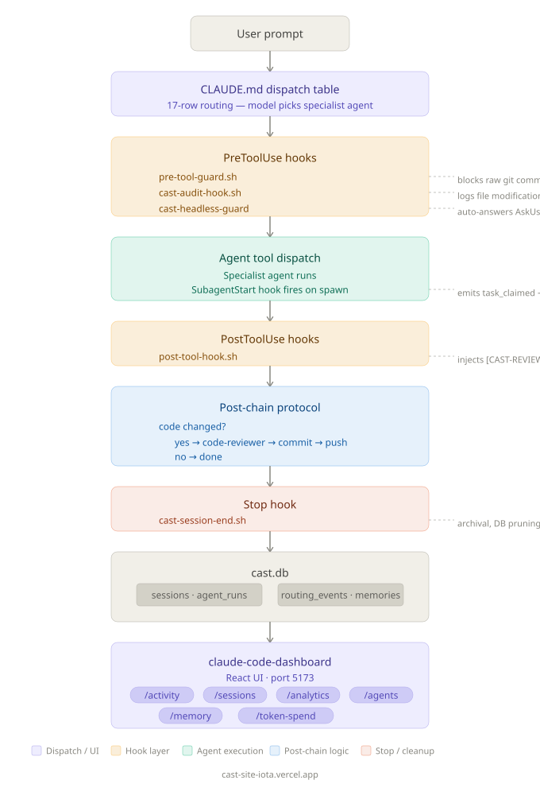

<p align="center">
  
</p>

# CAST — Claude Agent Specialist Team

[](https://github.com/ek33450505/claude-agent-team/actions/workflows/bats-ci.yml)
<!-- /CAST_VERSION_BADGE -->
<!-- CAST_AGENT_COUNT -->
<!-- CAST_TEST_COUNT -->


**A local-first multi-agent framework for Claude Code.** 17 specialist agents, hook-enforced quality gates, async observability, and a full SQLite audit trail — all running locally with zero cloud lock-in.

**[CAST](https://castframework.dev)** 
---

## What is CAST?

CAST turns Claude Code from a single-session assistant into a coordinated team:

- **Every task goes to the right expert.** Code changes dispatch to `code-writer`, failures to `debugger`, scripts to `bash-specialist`. The model reads a 17-row dispatch table and picks the agent — no regex, no routing config.
- **Quality is enforced, not requested.** Raw `git commit` and `git push` are hard-blocked by shell hooks. Every code change mandates a `code-reviewer` pass. Commit only happens through the `commit` agent.
- **Everything is observable.** Every agent dispatch, session, and token spend is logged to `cast.db` (SQLite). A companion React dashboard shows activity, analytics, agent status, and memory in real time.
- **Lightweight tasks use cheaper models automatically.** Haiku handles `code-reviewer`, `commit`, `push`, and `test-runner` — the high-frequency, low-complexity work. Sonnet handles planning, writing, and debugging. The cost difference is 20x per token. CAST routes silently; you pay for what the task actually needs.

---

## Architecture

Claude Code exposes ~40 discrete tools, each with a per-tool permission gate evaluated in `Deny → Ask → Allow` order, and an `AgentTool` that dispatches subagents as flat tool calls with no orchestration layer. Hook events (`PreToolUse`, `PostToolUse`, `SessionStart/Stop`, `SubagentStart/Stop`, `PostCompact`, `TaskCreated`) are first-class extension points. Context compaction runs at three internal tiers. An autonomous daemon mode and a coordinator pattern exist internally but are not yet shipped.

CAST is built to fill the gaps those unshipped features leave, and to make the hook system load-bearing rather than observational.

<p align="center">
  
</p>

---

### Where CAST extends Claude Code

| Claude Code (native) | CAST (on top) | Design rationale |
|---|---|---|
| `AgentTool` dispatches one subagent per call, no sequencing | Orchestrator executes Agent Dispatch Manifests: parallel batches fire simultaneously, sequential batches gate on prior completion, `owns_files` prevents write conflicts | Fills the gap left by the native coordinator pattern not yet shipping |
| No post-agent successor logic | Chain-maps: `code-writer` → `code-reviewer` → `commit` enforced by `PostToolUse` hook injecting `[CAST-CHAIN]` directive | Makes quality gates structural, not advisory |
| Hook system exists but carries no persistent state | `cast.db` (SQLite, WAL mode): 4 tables — `sessions`, `agent_runs`, `routing_events`, `agent_memories` | Turns ephemeral hook events into a queryable audit trail |
| No native cost display beyond statusline | Native `cost.total_cost_usd` exposed in statusline format; CAST statusline script surfaces it per-session | Claude Code now provides cost natively; CAST presents it |
| `PostCompact` fires but has no default handler | `cast-pre-compact-hook.sh` detects dumb-zone onset; `cast-post-compact-hook.sh` reinjects plan context | Both Pre and PostCompact are covered to prevent plan amnesia |
| `PreToolUse` exit codes 0/2 are the permission gate | `pre-tool-guard.sh` (exit 2 on raw `git commit`/`push`), `cast-audit-hook.sh` (file modification logging) | Security guard behavior migrated to native sandbox `denyRead`/`denyWrite` rules |

### On the native coordinator pattern

Claude Code's internal coordinator pattern specifies one coordinator spawning workers with isolated contexts, a shared scratchpad, a mailbox pattern for dangerous operations, and prompt cache prefix sharing between subagents. CAST's orchestrator covers most of this surface today — ADM batches, parallel dispatch, file ownership to prevent write contention, and checkpoint files for plan resumption across session disconnects. When the native coordinator ships, CAST adapts rather than competes: the ADM format maps onto the coordinator's worker model, hook coverage remains additive, and `cast.db` observability applies regardless of which dispatch path Claude Code uses internally.

---

## Quick Start

Three commands to a working CAST installation:

```bash
brew tap ek33450505/cast
brew install cast
cast doctor
```

`cast doctor` runs `cast-validate.sh` — checks hook wiring, agent files, database schema, and CLI path. Green across the board means you're ready.

**Git clone alternative:**

```bash
git clone https://github.com/ek33450505/claude-agent-team
cd claude-agent-team
bash install.sh
```

---

## Agent Roster

17 specialists. Each is a plain markdown file in `~/.claude/agents/` with YAML frontmatter defining model, memory, effort, and isolation.

| Agent | Model | Effort | Purpose |
|---|---|---|---|
| `code-writer` | sonnet | high | Feature implementation spanning files or logical units |
| `debugger` | sonnet | high | Root-cause diagnosis and fixes for failures |
| `planner` | sonnet | high | Breaks features into sequenced task plans with ADM |
| `orchestrator` | sonnet | high | Executes multi-agent plan manifests (ADM) |
| `researcher` | sonnet | high | Multi-source analysis, gap reports, data synthesis |
| `security` | sonnet | high | Auth, input validation, secrets, vulnerability audit |
| `merge` | haiku | low | Git merges, rebases, conflict resolution |
| `test-writer` | haiku | low | Unit and integration tests |
| `devops` | haiku | low | CI/CD, Docker, infrastructure |
| `docs` | haiku | low | Documentation, READMEs, changelogs |
| `morning-briefing` | haiku | low | Daily git activity summary |
| `bash-specialist` | haiku | low | Shell scripts, BATS tests, hook scripts |
| `code-reviewer` | haiku | low | Diff scan for correctness and conventions |
| `test-runner` | haiku | low | Runs test suites (bats, jest, vitest) |
| `commit` | haiku | low | Stages and commits with semantic messages |
| `push` | haiku | low | Pushes to remote with safety checks |
| `frontend-qa` | haiku | low | Frontend diff review, component audit |

All agents carry `memory: local` — each accumulates session knowledge in `~/.claude/agent-memory-local/<name>/`.

> 11 of 17 agents run on Haiku ($1/MTok input) — the high-frequency, pattern-following work. 6 agents run on Sonnet ($3/MTok input) for complex reasoning. Model tiering cuts token costs by 25-40% compared to running all agents on the same model.

---

## Token Efficiency

CAST is designed to minimize token spend without sacrificing quality. Multi-agent systems use 15x more tokens than single-turn chat (per Anthropic's own research) — every optimization compounds.

| Optimization | How It Works | Impact |
|---|---|---|
| Model tiering | 16 agents on Haiku, 9 on Sonnet — route by task complexity | 3x cost reduction on lightweight tasks |
| Response budgets | Agents have enforced token limits: 300 (lightweight), 800 (medium), 2,000 (heavy) | Prevents verbose responses from bloating context |
| Compressed Agent Protocol | Shared boilerplate condensed from ~310 tokens to ~100 tokens per agent | ~210 tokens saved per invocation |
| Orchestrator preamble tiers | Full context for implementation agents, minimal for lightweight agents | ~80 tokens saved per lightweight dispatch |
| Effort tuning | Haiku agents set to `effort: low` — no extended thinking overhead | Reduces output token waste |
| WebFetch efficiency | Researcher pre-screens URLs, caches results, writes to disk instead of passing raw content | Cuts researcher token spend (~27% of total) |
| Output compression | Orchestrator summarizes agent responses in <100 words, compacts at 30k tokens | Prevents context window bloat across batches |

Estimated savings: **25-40% reduction** in monthly token spend compared to unoptimized multi-agent dispatch.

---

## Hook Event Coverage

13 Claude Code lifecycle events are wired. Every event that matters for observability, safety, or pipeline automation is handled.

| Event | Hook Script | What It Does |
|---|---|---|
| `SessionStart` | `cast-session-start-hook.sh` | Opens session row in cast.db |
| `UserPromptSubmit` | `cast-user-prompt-hook.sh` | Logs prompt metadata to routing_events |
| `InstructionsLoaded` | `cast-instructions-loaded-hook.sh` | Logs session context load |
| `PreToolUse:Bash` | `pre-tool-guard.sh` | Hard-blocks `git commit` / `git push` (exit 2) |
| `PreToolUse:AskUserQuestion` | `cast-headless-guard.sh` | Auto-answers AskUserQuestion in pipelines |
| `PreToolUse:Write\|Edit` | `cast-audit-hook.sh` | Logs file modification events |
| `PostToolUse:Write\|Edit\|Agent\|Bash` | `post-tool-hook.sh` | Injects [CAST-REVIEW] directive after code changes |
| `PostToolUseFailure` | `cast-tool-failure-hook.sh` | Logs tool failures to cast.db |
| `PreCompact` | `cast-pre-compact-hook.sh` | Detects dumb-zone onset, emits pre_compact event |
| `PostCompact` | `cast-post-compact-hook.sh` | Reinjects plan context, emits context_compacted |
| `SubagentStart` | `cast-subagent-start-hook.sh` | Emits task_claimed on agent spawn (async) |
| `SubagentStop` | `cast-subagent-stop-hook.sh` | Closes agent_runs row on completion (async) |
| `SessionEnd` | `cast-session-end.sh` | Archives session, closes DB row, syncs memory |

**Exit code convention:**
- Exit 0 — hook passed, tool call proceeds
- Exit 2 — hook blocked the tool call (guard hooks only)
- Never exit 1 (reserved for fatal hook errors)

---

## Observability

`cast.db` at `~/.claude/cast.db` — append-only SQLite. Never truncated.

| Table | Contents |
|---|---|
| `sessions` | Session start/end, model, token counts |
| `agent_runs` | Every dispatch: agent, model, duration, status, batch_id |
| `routing_events` | Prompt routing records, event types, JSON payloads |
| `agent_memories` | Synced from `~/.claude/agent-memory-local/` on Stop; temporal validity (valid_from/valid_to) |

```bash
# Live TUI dashboard — htop for CAST (requires: pip install textual)
cast dash

# Usage analytics
bash scripts/cast-stats.sh

# Health check
bash scripts/cast-validate.sh   # also available as: cast doctor

# Query recent agent runs
sqlite3 ~/.claude/cast.db "SELECT agent, status, created_at FROM agent_runs ORDER BY id DESC LIMIT 10;"
```

`cast dash` is a Textual-based terminal UI. It reads `cast.db` and `~/.claude/` directly — no web browser required. Shows active agents, today's stats with a sparkline, recent runs table, and system health panel. Updates live. Requires the `textual` Python package (installed automatically by `install.sh`).

---

## Multi-Agent Pipelines

The `orchestrator` agent executes plans defined by an **Agent Dispatch Manifest (ADM)** — a JSON structure inside plan files. Plans live in `~/.claude/plans/`.

**ADM structure:**

```json
{
  "batches": [
    {
      "id": 1,
      "parallel": true,
      "agents": [
        {
          "subagent_type": "code-writer",
          "owns_files": ["/abs/path/to/file.sh"],
          "prompt": "..."
        },
        {
          "subagent_type": "security",
          "owns_files": ["/abs/path/to/other.sh"],
          "prompt": "..."
        }
      ]
    },
    {
      "id": 2,
      "parallel": false,
      "agents": [{ "subagent_type": "commit", "prompt": "..." }]
    }
  ]
}
```

`owns_files` prevents two parallel agents from writing the same file. The orchestrator detects conflicts before dispatch and blocks the batch if any overlap exists.

```bash
# Run a plan
cast exec ~/.claude/plans/my-plan.md

# Run a plan across two parallel worktree sessions
# Splits batches at the midpoint, launches two claude --headless processes
# in separate git worktrees, and merges results back when both complete
cast parallel ~/.claude/plans/my-plan.md

# Preview the batch split without executing
cast parallel --dry-run ~/.claude/plans/my-plan.md

# Control the split point (batches 1-2 in Stream A, rest in Stream B)
cast parallel --split 2 ~/.claude/plans/my-plan.md

# Or dispatch the orchestrator agent directly:
# "Orchestrate the plan at ~/.claude/plans/my-plan.md"
```

---

## Agent Memory

Each agent has a persistent markdown-based memory directory. Agents accumulate domain knowledge across sessions.

```
~/.claude/agent-memory-local/
  code-writer/
    MEMORY.md              ← index (loaded into every session)
    feedback_testing.md    ← user guidance on testing approach
    project_auth.md        ← project-specific auth context
  debugger/
    MEMORY.md
    ...
```

Memory files are plain markdown with YAML frontmatter. `cast-session-end.sh` syncs them to `agent_memories` in cast.db on every Stop. The markdown files are the source of truth.

```bash
# Back up all agent memory to a GitHub release
bash scripts/cast-memory-backup.sh --dry-run   # preview only
bash scripts/cast-memory-backup.sh             # creates tarball + gh release
```

---

## Memory Persistence

CAST v4.3 adds FTS5-indexed full-text search, relevance scoring, shared memory pool, procedural memory type, semantic embeddings, session distillation, staleness validation, MCP server access, and weekly consolidation. All state lives in `cast.db` — no external services required.

### FTS5 Schema

The `agent_memories_fts` virtual table indexes `content` and `description` columns for full-text search. Three triggers (`am_ai`, `am_au`, `am_ad`) keep the index in sync with `agent_memories` on insert, update, and delete. Migration:

```bash
python3 scripts/cast-memory-fts5-migrate.py
```

### Relevance Scoring

Weighted formula: `0.4 * recency + 0.3 * importance + 0.3 * fts_rank`. Recency decays exponentially using per-type decay rates:

| Memory Type | Decay Rate |
|---|---|
| `feedback`, `user` | 0.999 |
| `reference` | 0.997 |
| `project` | 0.990 |

The `importance` column (0.0–1.0) weights critical memories higher. Default importance is backfilled by type.

### Shared Pool

Memories with `agent='shared'` are visible to all agents. The router query uses `WHERE (agent = ? OR agent = 'shared')`, so shared memories appear alongside agent-specific results without duplication.

### Procedural Memory

`type='procedural'` stores operational patterns — BATS whitespace fixes, sandbox workarounds, orchestrator dispatch patterns. Seeded by `cast-memory-seed-procedural.py`. Auto-loaded into agent sessions at start.

```bash
python3 scripts/cast-memory-seed-procedural.py   # seed 5 built-in patterns
```

### Semantic Search

Optional Ollama dependency. `cast-memory-embed.py` generates 768-dim nomic-embed-text embeddings stored as BLOBs in `agent_memories.embedding`. Hybrid search combines FTS5 rank with cosine similarity for more accurate retrieval.

```bash
# Backfill embeddings for all existing memories
python3 scripts/cast-memory-embed.py --backfill

# Embed a single text
python3 scripts/cast-memory-embed.py --text "how to fix BATS whitespace"
```

Requires Ollama running locally with `nomic-embed-text` pulled. Without Ollama, FTS5-only search is used automatically.

### Temporal Validity

`valid_from` and `valid_to` columns on `agent_memories` let facts be superseded without deletion — preserving history while keeping current queries clean. Run the migration to add these columns:

```bash
python3 scripts/cast-memory-migrate-temporal.py
```

Default queries filter `WHERE valid_to IS NULL` to return only current facts. Use `--history` to include superseded memories, or `--invalidate <id>` to mark a memory as superseded:

```bash
# Retrieve only current memories (default)
python3 scripts/cast-memory-router.py --mode retrieve --agent shared --prompt "test"

# Include superseded memories
python3 scripts/cast-memory-router.py --mode retrieve --agent shared --prompt "test" --history

# Mark memory #42 as superseded
python3 scripts/cast-memory-router.py --invalidate 42
```

### Session Distiller

`cast-session-distiller.py` runs at session end, extracting decisions, patterns, and failures into procedural memories. Captures operational knowledge that would otherwise be lost at session close.

```bash
python3 scripts/cast-session-distiller.py
```

### Staleness Validation

`cast-memory-validate.py` flags memories older than 30 days and verifies that file and function references still exist in the codebase. Outputs a JSON report sorted by staleness score.

```bash
python3 scripts/cast-memory-validate.py --check          # report only
python3 scripts/cast-memory-validate.py --validate        # update timestamps
python3 scripts/cast-memory-validate.py --archive-stale   # zero-out stale importance
```

### MCP Server

`cast-mcp-memory-server.py` wraps `agent_memories` as an MCP resource, allowing external tools and editors to read and search CAST memory. Configured in `.mcp.json`.

### Consolidation

`cast-memory-consolidate.py` runs weekly via cron. Deduplicates similar memories, applies decay, and archives memories below the relevance threshold.

```bash
python3 scripts/cast-memory-consolidate.py   # run manually
```

### Standalone Install

For users who want memory persistence without full CAST:

```bash
brew tap ek33450505/cast-memory && brew install cast-memory
```

See [cast-memory](https://github.com/ek33450505/cast-memory).

---

## Dashboard

[claude-code-dashboard](https://github.com/ek33450505/claude-code-dashboard) — React 19 + Vite + Express observability UI for CAST.

Reads `cast/events/`, `agent-status/`, and `cast.db` directly — no backend API required for reads.

| Page | What It Shows |
|---|---|
| `/activity` | Live agent spawn timeline, hook events |
| `/sessions` | Session list with compaction markers |
| `/analytics` | Token spend by agent, prompt volume over time |
| `/agents` | Agent roster status, last active, run count |
| `/hooks` | Hook health: fired/blocked/failed counts |
| `/plans` | Plan files, ADM batch status |
| `/memory` | Per-agent MEMORY.md viewer, last-modified |
| `/token-spend` | Budget burn rate, cost trends |
| `/db` | Raw cast.db explorer |

```bash
cd ~/Projects/personal/claude-code-dashboard
npm run dev    # Vite :5173 + Express :3001
```

---

## Project Structure

```
claude-agent-team/
  agents/
    core/               ← 17 agent definitions (mirrored to ~/.claude/agents/)
  docs/                 ← architecture specs, native-tools-reference.md, protocol docs
  scripts/              ← hook scripts, utilities, cron setup
  tests/
    *.bats              ← core test suite
    hooks/              ← hook-specific BATS tests
    agents/             ← agent frontmatter BATS tests
    scripts/            ← script utility BATS tests
  .github/
    workflows/
      bats-ci.yml       ← BATS CI on push + daily schedule
      cast-pr-review.yml← Automated PR review via claude-code-action
  .mcp.json             ← Project-scoped MCP server config
  install.sh
  VERSION
  CHANGELOG.md
```

**Runtime (outside repo, in `~/.claude/`):**

```
~/.claude/
  agents/               ← live agent definitions (copied from agents/core/)
  agent-memory-local/   ← per-agent persistent memory
  plans/                ← planner output + ADM plan files
  settings.json         ← Claude Code config with all hooks registered
  cast.db               ← SQLite observability database
  cast/events/          ← append-only event log (one JSON per session)
  scripts/              ← installed hook scripts
  logs/                 ← pipeline, headless-stalls, memory-backup logs
```

---

## Scheduled Tasks

Pure cron. No daemon. No background process.

| Schedule | Script | Purpose |
|---|---|---|
| Daily 7am | morning-briefing agent | Git activity summary across all repos |
| Daily 6pm | cast-stats.sh | Daily usage summary |
| Monday 9am | cast-stats.sh --weekly | Weekly cost report |
| Daily 2am | cast-memory-backup.sh | Backup agent memory to GitHub release |

```bash
bash scripts/cast-cron-setup.sh          # install
bash scripts/cast-cron-setup.sh --list   # view
bash scripts/cast-cron-setup.sh --remove # uninstall
```

Manual cleanup is available via `cast tidy`:

```bash
cast tidy            # clean plans, events, logs, db rows, briefings older than 14 days
cast tidy --dry-run  # preview what would be removed
```

---

## Test Suite

324 BATS tests across 4 directories. 0 failures.

```bash
# Run all tests
bats tests/

# Run a specific category
bats tests/hooks/
bats tests/agents/
bats tests/scripts/
```

Tests cover: hook scripts, guard logic, event emission, stats generation, DB init, cron setup, agent-status reader, effort frontmatter, headless guard, and memory backup.

---

## Version History

| Version | Highlights |
|---|---|
| v1 | Manual dispatch, no hooks, no memory |
| v2 | 42 agents, routing table, regex dispatch, castd daemon |
| v3.0 | 16 agents, model-driven dispatch, 4 hooks, cron, cast.db |
| v3.1 | Async hooks, worktree isolation, per-agent memory, headless pipelines, GitHub CI |
| v3.3 | Audit hardening: WAL mode, structured error logging, SQL injection fix, PII advisory mode, orchestrator resilience (checkpoints, policy gate, TRUNCATED classification), 4 scripts committed to repo |
| v3.4 | Security hardening: Python injection fix, path injection fix, --model flag on CLI; portability: __HOME__ tokens replace hardcoded paths; settings cleanup; daemon cleanup (flock lockfile); frontend-qa agent added; docs/native-tools-reference.md; 324 BATS tests |
| v4.0 | Major cleanup: gut 33 hooks to 15, slim CLI from 2331→976 lines, installer 351→193 lines; drop 5 empty DB tables (9→4 canonical); delete observe-* shadow system, daemon, routing scripts; rebuild cast.db at v7 with batch_id; 271 BATS tests |
| v4.1 | Native adoption: replace cost-tracker with native statusline, remove prettier hook, delete 4 dead routing scripts, migrate security guard to sandbox rules, add PreCompact hook, add effort/background/initialPrompt to agent frontmatter; 262 BATS tests |
| v4.2 | `cast dash` TUI dashboard (Textual, htop for CAST); `cast tidy` cleanup subcommand; CHEATSHEET.md; morning-briefing fixes; spinnerVerbs settings fix |
| v4.3 | Memory persistence: FTS5 search, relevance scoring, shared pool, procedural memory, semantic embeddings, session distiller, staleness validation, MCP server, weekly consolidation, standalone cast-memory repo |
| v4.4 | Temporal validity on agent_memories, session distiller rewrite with regex extraction |
| v4.5 | Token efficiency: model tiering (11 Haiku / 6 Sonnet), response budgets, compressed Agent Protocol, orchestrator preamble tiers, research URL cache, token budget alerts — 25-40% cost reduction; Local-first hardening: macOS Keychain integration, age encryption with Secure Enclave binding, WAL-safe SQLite backups, network detection with offline queue, Ollama local model fallback, parallel plan execution across dual worktrees; 357 BATS tests |
| v4.6 | JARVIS extracted to standalone repo (ek33450505/jarvis) — 8 pa-* agents, 7 launchd plists, install/uninstall scripts; core roster is 17 agents |

## CAST Ecosystem

CAST is split across focused repos. The core framework lives here; install individual pieces or use the Homebrew taps.

| Repo | Description | Homebrew Tap |
|---|---|---|
| [claude-agent-team](https://github.com/ek33450505/claude-agent-team) | Core framework — agents, hooks, CLI, observability | `ek33450505/cast` |
| [cast-agents](https://github.com/ek33450505/cast-agents) | Agent definition library | `ek33450505/cast-agents` |
| [cast-observe](https://github.com/ek33450505/cast-observe) | Observability scripts and cast.db tooling | `ek33450505/cast-observe` |
| [cast-security](https://github.com/ek33450505/cast-security) | Security hooks and audit tooling | `ek33450505/cast-security` |
| [cast-hooks](https://github.com/ek33450505/cast-hooks) | Hook scripts framework — 13 hooks, CLI tool (v0.1.0) | `ek33450505/cast-hooks` |
| [cast-dash](https://github.com/ek33450505/cast-dash) | TUI dashboard — 4-panel live display (v0.1.0) | `ek33450505/cast-dash` |
| [cast-memory](https://github.com/ek33450505/cast-memory) | Standalone memory persistence — FTS5, embeddings, MCP (v0.1.0) | `ek33450505/cast-memory` |
| [cast-parallel](https://github.com/ek33450505/cast-parallel) | Parallel plan execution across dual worktrees (v0.1.0) | `ek33450505/cast-parallel` |
| [homebrew-cast](https://github.com/ek33450505/homebrew-cast) | Homebrew formula for core CAST | — |
| [jarvis](https://github.com/ek33450505/jarvis) | Personal Assistant agents (pa-briefing, pa-triage, pa-jira, pa-eod, pa-weekly, pa-meeting-prep, pa-calendar, pa-backup) | `ek33450505/jarvis` |
| [homebrew-jarvis](https://github.com/ek33450505/homebrew-jarvis) | Homebrew formula for JARVIS | — |

**11 repos, 9 Homebrew taps.**

---

## Local-First

CAST v4.5 adds local-first hardening for data protection and offline workflows:

- **macOS Keychain integration** for API key storage (`cast-keychain.sh`)
- **age encryption** for agent memory with optional Secure Enclave binding (`cast-encrypt.sh`)
- **WAL-safe SQLite backups** with 7-day retention (`cast-db-backup.py`)
- **Network detection** with offline queue and auto-replay (`cast-connectivity.sh`)
- **Ollama local model fallback** for offline tasks (`cast-ollama.sh`)
- **Parallel plan execution** across dual worktrees (`cast-parallel.sh`)

---

## Contributing

See [CONTRIBUTING.md](CONTRIBUTING.md). Open an issue first for non-trivial changes. PRs automatically trigger the `cast-pr-review.yml` workflow — the `code-reviewer` agent reviews your diff and posts inline comments.

---

## License

MIT — see [LICENSE](LICENSE).

---

## Stats

<!-- CAST_AGENT_COUNT -->17<!-- /CAST_AGENT_COUNT --> agents |
<!-- CAST_TEST_COUNT -->443<!-- /CAST_TEST_COUNT --> tests |
<!-- CAST_COMMAND_COUNT -->18<!-- /CAST_COMMAND_COUNT --> commands |
<!-- CAST_SKILL_COUNT -->9<!-- /CAST_SKILL_COUNT --> skills
