<p align="center">
  
</p>

# CAST v7.1 — Backend Lockdown

[](https://github.com/ek33450505/claude-agent-team/actions/workflows/bats-ci.yml)
<<<<<<< Updated upstream
<!-- /CAST_VERSION_BADGE -->
<!-- CAST_AGENT_COUNT -->
<!-- CAST_TEST_COUNT -->
||||||| Stash base
<!-- /CAST_VERSION_BADGE -->
<!-- CAST_AGENT_COUNT -->
<!-- CAST_TEST_COUNT -->
=======
<!-- /CAST_VERSION_BADGE -->
<!-- CAST_AGENT_COUNT -->
<!-- CAST_TEST_COUNT -->
>>>>>>> Stashed changes


> CAST is a production control plane for Claude Code built on three pillars: **hook enforcement** (every agent change is gated by validators — `cast-validate-all-hooks.sh` runs in CI and hookSpecificOutput shape is contract-validated), **audit trail** (cast.db with <!-- CAST_DB_TABLE_COUNT -->27<!-- /CAST_DB_TABLE_COUNT --> tables records every session, agent run, routing decision, quality gate, and memory write), and a **typed agent registry** (<!-- CAST_AGENT_COUNT -->22<!-- /CAST_AGENT_COUNT --> agents, model-assigned across haiku 4.5 / sonnet / opus tiers, quality-gated, with frontmatter contracts). Define a workflow once; specialist agents plan, implement, review, test, and commit — automatically.

**[CAST Framework](https://castframework.dev)**

---

## Installation

### Homebrew

```bash
brew tap ek33450505/cast && brew install cast
```

### Manual install

```bash
git clone https://github.com/ek33450505/claude-agent-team.git
cd claude-agent-team
bash install.sh
```

This is for users who don't use Homebrew or want to install directly from source.

---

## Quick Start

**[docs/tutorial/getting-started.md](docs/tutorial/getting-started.md)** — install, verify, and run `cast status` in 5 minutes.

---

## What Makes CAST Different

- **Quality gates that actually enforce.** Raw `git commit` and `git push` are hard-blocked by hooks. Code changes mandate a reviewer pass. You cannot skip this.
- **<!-- CAST_AGENT_COUNT -->22<!-- /CAST_AGENT_COUNT --> specialist agents, pre-configured.** Each has a bounded scope, a model tier, and a thinking budget. `code-writer` implements; `code-reviewer` reviews; `commit` commits. They don't cross lanes.
- **SQLite audit trail, fully local.** Every agent dispatch, tool call, and token spend logs to `cast.db` on your machine. No SaaS dashboard, no cloud lock-in.
- **<!-- CAST_TEST_COUNT -->1011<!-- /CAST_TEST_COUNT --> BATS test cases with 0 failures.** Every hook script and utility is covered. CI runs on both macOS and Ubuntu on every push.

---

## Documentation

| Guide | Description |
|---|---|
| [Tutorial](docs/tutorial/getting-started.md) | Install CAST and run your first agent dispatch |
| [Compatibility Matrix](docs/compatibility.md) | Claude Code version requirements and known breakages |
| [Hook Authoring Guide](docs/hooks/authoring-guide.md) | Write, test, and install custom hook scripts |
| [Full Docs Index](docs/README.md) | All documentation with one-line descriptions |

---

<!-- TODO(ed): record 10s asciinema of `cast status` + an orchestrate run, replace this block with the SVG/GIF -->
<p align="center">
  <em>Demo: <code>cast status</code> + orchestrate run — recording in progress</em>
</p>

---

## Table of Contents

- [What is CAST?](#what-is-cast)
- [Tutorial](docs/tutorial/getting-started.md)
- [Compatibility](docs/compatibility.md)
- [Your First Workflow](#your-first-workflow)
- [Architecture](#architecture)
- [Personal Overlay — Layered Configuration](#personal-overlay--layered-configuration)
- [Swarm System](#swarm-system)
- [Agent Constellation Dashboard](#agent-constellation-dashboard)
- [Agents](#agents)
- [Token Efficiency & Cost Optimization](#token-efficiency--cost-optimization)
- [Hooks](#hooks)
- [Observability & cast.db v8](#observability--castdb-v8)
- [Peer Messaging & Gossip Protocol](#peer-messaging--gossip-protocol)
- [Multi-Agent Pipelines (v4.6+)](#multi-agent-pipelines-v46)
- [Agent Memory & Persistence (v4.3+)](#agent-memory--persistence-v43)
- [Routines: Scheduled Workflows (v4.6+)](#routines-scheduled-workflows-v46)
- [Project Structure](#project-structure)
- [Scheduled Tasks](#scheduled-tasks)
- [Testing](#testing)
- [Version History](#version-history)
- [CAST Ecosystem](#cast-ecosystem)
- [Local-First & Offline](#local-first--offline)
- [Contributing](#contributing)
- [License](#license)
- [Author](#author)
- [Stats](#stats)

---

## What is CAST?

CAST transforms Agent Teams into a **production control plane:**

- **Swarm composition in YAML.** Define teams, assign roles, set quality gates. CAST bootstraps worktrees, seeds teammates with identity + prompts, manages peer messaging.
- **Structural quality gates.** Code changes mandate a reviewer pass. Raw `git commit` and `git push` are hard-blocked by hooks.
- **Full observability.** Every session, task, peer message, and token spend logs to `cast.db` (SQLite).
- **Local model routing.** Haiku agents route to Ollama; cost per swarm drops 40-60% with LiteLLM proxy.

---

## Your First Workflow

1. **Plan** — `/plan add user auth feature` → planner writes an Agent Dispatch Manifest.
2. **Execute** — `/orchestrate next` → code-writer implements, code-reviewer checks, test-runner verifies, commit agent stages.
3. **Ship** — `/ship` → tests, CI sanity check, push, journal entry.

---

## Architecture

Every CAST operation follows a four-stage flow: (1) **hook validation** — pre-tool hooks enforce quality gates and block non-compliant writes before any change lands; (2) **agent dispatch** — the typed agent registry routes work to the correct model tier (haiku 4.5 for review/commit, sonnet for implementation, opus for migration review); (3) **memory injection** — each agent receives relevant prior-session context from its `~/.claude/agent-memory-local/<name>/MEMORY.md` on startup; (4) **cast.db audit** — every session, routing decision, quality gate result, and token spend is appended to the local SQLite database. See [docs/architecture/ARCHITECTURE.md](docs/architecture/ARCHITECTURE.md) for the full guide including Agent Teams comparison table.

<p align="center">
  
</p>

---

## Recent Capabilities (v7.1)

**cast.db observability remediation** — closed 15+ findings from the 2026-05-16 audit. Three sequential PRs (#74 P0, #75 P1, #77 P2) bundled into v7.1.

- **`log_hook_failure()` wired end-to-end** — every silent `except Exception: pass` block in hook scripts now routes failures to the `hook_failures` table. The meta-bug: helper existed at `scripts/cast_db.py:204` with zero callers. Closing it surfaces every other broken writer in real time.
- **`quality_gates` writer repaired** — `cast-subagent-stop-hook.sh` INSERT used the pre-migration-009 column set; broke silently for months. Now lands rows for every sub-agent stop with `status_line`, `contract_passed`, and a TRUNCATED row when no Status block is detected.
- **Stop hook scoped correctly** — added precondition guard so `agent_truncations` no longer captures main-session user content. Improved `agent_type` fallback by joining `agent_runs` on `agent_id`.
- **`agent_memories` schema drift closed** — migration 013 adds `last_validated_at` + `retrieval_count`; memory validation/consolidation scripts no longer swallow column-missing errors.
- **`injection_log` writer built** — schema and cast-desktop reader existed; writer was never wired. `cast-memory-router.py` now writes one row per injected fact with score breakdown.
- **`cast-db-routines.py` path-prefix validation** — `update-status` and `upsert` reject `output_path` outside `~/.claude/routines-output/`. Path-traversal class fix from cast-desktop security review.
- **Daily-briefing routine restored** — trimmed `prompt_template` after 5-day failure with "Prompt is too long".
- **`compaction_events` observability wired** — three compact-hook scripts had silent swallows; routed through `log_hook_failure()` so future silence is loud.
- **Dead `agent_runs.model_used` column dropped** — migration 014. Runner now tolerates "no such column" on `ALTER DROP` (mirrors existing "duplicate column" tolerance on `ALTER ADD`).
- **`docs/cast-db-schema-rationale.md`** — decoder ring for confusing table groups (three "dispatch" tables, failure-tracking pairs, swarm tables, the documented `schema_migrations` dual-runner drift for P3).
- **Proof of life:** `hook_failures` went from 0 rows (helper had zero callers) to 10+ rows over the remediation arc — real silent failures now surfacing.

## Recent Capabilities (v7.0)

**Anthropic API Integration:**
- **Files API adapter** — `scripts/cast-files-api.sh` wraps the Anthropic Files API with upload/download/delete commands. Opt-in via `CAST_FILES_API=1` environment variable. Test and morning-briefing agents can upload reports as file objects instead of pasting inline.
- **Citations API guidance** — `researcher` and `learning-scout` agents prefer document-grounded completions via the Citations API, with fallback to `[unverified]`-flagged markdown links for sources that cannot be verified.
- **Vision capture step** — `scripts/cast-screenshot.sh` integrates Playwright or Puppeteer for full-page screenshot capture. `frontend-qa` agent visually inspects layouts, color contrast, and rendering before text-only analysis. Graceful degradation when tools unavailable.

**Agent Enhancements:**
- **Per-agent extended thinking budgets** — Every agent has a fine-grained thinking token allocation: HIGH (8192) for debugger, security, planner, researcher, migration-reviewer, perf-sentinel, api-contract; MEDIUM (4096) for code-writer, test-writer, learning-scout, and others; LOW (0) for fast agents like commit, code-reviewer, merge.
- **Commit agent identity clarification** — Explicit instruction that the commit agent is authorized to run `CAST_COMMIT_AGENT=1 git commit` directly, eliminating recursion confusion.

**Quality & Observability:**
- **Stat-claim verification hook** — `scripts/cast-stat-claim-guard.sh` blocks README.md writes/edits with incorrect test count badges, using `git ls-files` as source of truth. Prevents badge drift during updates.
- **Truncated response detection** — `scripts/cast-response-completeness-hook.sh` logs agent responses missing Status blocks to `~/.claude/logs/hook-errors.log` and `cast.db`, flagging potential context window exhaustion.
- **Parry-guard monitoring** — `scripts/cast-parry-guard-monitor.sh` tracks security gate rejections, identifies possible false positives (≥3 rejections of same tool in 24h), and surfaces anomalies in `morning-briefing` output.
- **Cookbook drift tracking** — `scripts/cast-cookbook-drift.sh` monthly dispatcher audits CAST patterns against Anthropic Cookbook for deprecated APIs and missing features. Reports to `~/.claude/reports/`.
- **Prompt cache metrics** — `scripts/cast-cache-metrics.sh` computes 30-day cache hit rates from cast.db, writing JSON reports and tracking efficiency trends.

**Testing & Deployment:**
- **BATS un-vendored** — BATS framework now installed via package manager (`brew install bats-core` on macOS, `apt-get install bats` on Ubuntu) instead of vendored in repo. Reduces checkout bloat, simplifies CI.

---

## Personal Overlay — Layered Configuration

CAST ships in two layers: `core` (always installed) and `personal` (optional, `--personal` flag).

| Layer | Contents | Installed |
|---|---|---|
| `rules-core/` | Generic conventions (shell, python, typescript) | Always |
| `agents/core/` | Specialist agents (code-writer, debugger, planner, …) | Always |
| `rules-personal/` | Maintainer project catalog, identity traits | `--personal` |
| `agents/personal/` | Maintainer-specific agents (e.g., portfolio-sync) | `--personal` |

New clones get a trustworthy, generic installation. `rules-personal/` ships empty for clones to populate.

---

## Swarm System

CAST swarms are defined in YAML and bootstrapped with `cast swarm bootstrap`. Teams get isolated worktrees, agent identity, peer messaging, and quality gates. See [docs/architecture/ARCHITECTURE.md](docs/architecture/ARCHITECTURE.md#swarm-system).

---

## Agent Constellation Dashboard

**Constellation** — force-directed graph showing agent nodes, task satellites, token heatmaps, peer messages, and hook audit trails in real time. Part of [claude-code-dashboard](https://github.com/ek33450505/claude-code-dashboard). See [docs/observability/OBSERVABILITY.md](docs/observability/OBSERVABILITY.md#agent-constellation-dashboard).

**Cast Desktop** — Tauri 2 native app surfacing the same observability layer with an embedded PTY terminal, command palette, and 11 dashboard views. See [cast-desktop](https://github.com/ek33450505/cast-desktop) (v0.1.0).

---

## Agents

30 core specialists. Each is a markdown file in `~/.claude/agents/` with YAML frontmatter defining model, memory, isolation, and thinking budget tier. Agent responses validate against JSON schemas in `schemas/`. See [docs/agents/AGENT-ROSTER.md](docs/agents/AGENT-ROSTER.md) for the full table with model tiers and thinking budgets.

Key agents: `code-writer`, `debugger`, `planner`, `researcher`, `security`, `code-reviewer`, `commit`, `push`, `test-writer`, `devops`, `bash-specialist`, `migration-reviewer`, `api-contract`, `dep-auditor`, `perf-sentinel`.

---

## Token Efficiency & Cost Optimization

Model tiering, response budgets, Ollama local routing, laconic mode, and RTK compression achieve ~30-50% token spend reduction. See [docs/TOKEN-OPTIMIZATION.md](docs/TOKEN-OPTIMIZATION.md).

### Optional: Local-first cheap-mode (claude-code-router)

For local Haiku-tier work without API spend, install [claude-code-router](https://github.com/musistudio/claude-code-router) and run `ccr` instead of `claude`. CCR proxies all model calls to local Ollama (default: `deepseek-coder:latest`). Opt-in per session — vanilla `claude` continues to use Anthropic API.

**Install:** `npm install -g @musistudio/claude-code-router`  
**Config:** `~/.claude-code-router/config.json` (CAST-compatible default ships with this repo)  
**Use for:** code-reviewer-only sessions, doc edits, quick exploration  
**Avoid for:** sonnet/opus-tier agents (code-writer, debugger, planner, researcher) — local models cannot match

---

## Hooks

Hooks cover the full swarm lifecycle: SessionStart, TaskCreated, WorktreeCreate, PreToolUse:Bash (commit guard), PostToolUse, PostCompact, SessionEnd. See [docs/observability/OBSERVABILITY.md](docs/observability/OBSERVABILITY.md#hook-event-coverage).

### Recent Hook Enhancements (Phase A–C, as of 2026-04-26)

**New Hook Events:**
- **StopFailure** (REC-01) — Fires when agent API calls fail mid-task. Logs error details to `cast.db` `stop_failure_events` table; triggers osascript desktop notification with error context.
- **CwdChanged** (REC-06) — Reads `.claude/cast.json` repo metadata and exports `CAST_REPO_CLASS` environment variable (values: `personal`, `work`). Enables repo-aware hooks and agent behavior.
- **SessionStart** — Now reads the latest `~/Documents/Claude/YYYY-MM/*.md` journal entry (if present) and injects a context banner for continuity. Sourced via `cast-claudes_journal` standalone repo.

**Hook Matcher Pattern (REC-02):**
All PreToolUse/PostToolUse hook entries in CAST agent definitions already use the `matcher` field as an equivalent pre-filter to the deprecated `if` field. No migration needed.

**Trail of Bits Security Skills:**
Install security audit skills via `/plugin marketplace add trailofbits/skills`. Integrated with `security` agent for enhanced vulnerability scanning. Requires Claude Code v2.1.118+.

**Managed Agents & Forked Subagents (REC-04):**
Parallel local agent dispatch via `cast-managed-agent.sh --fork` exports `CLAUDE_CODE_FORK_SUBAGENT=1` for worktree-free parallel work. Managed Agents preferred for long-running autonomously-executed tasks.

**Rate Limits API (REC-05):**
`cast-rate-check.py` snapshots `cast.db` `rate_limit_snapshots` table on SessionStart, capturing Anthropic API rate limit headroom. Surfaced in `morning-briefing` output to prevent surprise throttling.

**PreCompact Guard Block (REC-10):**
`/compact` now blocks when the current git repository has staged or unstaged changes. Gracefully passes through outside git worktrees. Prevents accidental context loss mid-work.

**Agent initialPrompt Frontmatter (REC-08):**
`morning-briefing` and `standup-writer` agents auto-load context from agent definition `initialPrompt` field on first turn, reducing cold-start latency and improving continuity.

**Journal Continuity:**
SessionStart hook reads the latest dated journal entry from Claude's Journal (cast-claudes_journal standalone repo) and injects it as a SessionStart banner. Enables context carryover from prior day without explicit carry-forward.

---

## Observability & cast.db v8

SQLite WAL mode at `~/.claude/cast.db` — append-only, never truncated. Stores swarm_sessions, teammate_runs, teammate_messages, agent_runs, routing_events, stream_events. See [docs/observability/OBSERVABILITY.md](docs/observability/OBSERVABILITY.md#observability--castdb-v8).

---

## Peer Messaging & Gossip Protocol

Teammates communicate via cast.db message bus — no central broker, fully decentralized. Types: task_claim, status_update, peer_query, idle_event. See [docs/architecture/ARCHITECTURE.md](docs/architecture/ARCHITECTURE.md#peer-messaging--gossip-protocol).

---

## Multi-Agent Pipelines (v4.6+)

The `/orchestrate` skill executes **Agent Dispatch Manifests (ADM)** — JSON plan files defining sequential/parallel agent batches. `owns_files` prevents write conflicts between parallel agents. See [docs/architecture/ARCHITECTURE.md](docs/architecture/ARCHITECTURE.md#multi-agent-pipelines) for the full ADM format.

```bash
cast exec ~/.claude/plans/my-plan.md
cast parallel ~/.claude/plans/my-plan.md --dry-run
```

---

## Agent Memory & Persistence (v4.3+)

Each agent accumulates domain knowledge in `~/.claude/agent-memory-local/<name>/MEMORY.md`. Features: FTS5 full-text search, relevance scoring, temporal validity (history preserved), shared pool (`agent='shared'`), procedural memory, session distiller. See [docs/architecture/ARCHITECTURE.md](docs/architecture/ARCHITECTURE.md#agent-memory).

---

## Routines: Scheduled Workflows (v4.6+)

**Routines** are time-triggered or event-triggered autonomous agent jobs — daily briefings, inbox triage, infrastructure checks, and reports that run on a schedule without user interaction. Define task once in YAML, schedule via cron, and forget it.

**11 built-in routines:**

| Routine | Schedule | Purpose |
|---|---|---|
| `daily-briefing` | 7am daily | Morning briefing: agent activity, blockers, urgent flags |
| `daily-cast-health` | 8pm daily | CAST infrastructure health (hooks, db, agents) |
| `email-triage` | Manual | Gmail inbox triage, priority buckets, draft replies |
| `knowledge-curator` | 10am daily | Obsidian vault organization, orphaned notes, link suggestions |
| `learning-scout` | 3pm daily | Tech topic monitor, learning resource curation |
| `meeting-prep` | 6am daily | Calendar-driven briefs for today's meetings |
| `pr-narrator` | 30min after GitHub webhook | PR storyteller, change summary, risk flags |
| `release-celebration` | Manual | Release notes + stakeholder brief |
| `standup-writer` | 4pm daily | Daily standup (blockers, wins, next 24h) |
| `task-triage` | 8am daily | Todoist overdue, BLOCKED agents, priorities |
| `weekly-cost-report` | Mon 9am | Claude API cost breakdown by agent, trends |

Manage with `cast routines list`, `cast routines trigger <name>`, `cast routines schedule <name>`. Full guide: [docs/routines.md](docs/routines.md).

---

## Project Structure

```
claude-agent-team/
  agents/{core,personal}/   ← agent definitions
  config/                   ← LiteLLM proxy, managed-settings.d/
  rules-{core,personal}/    ← conventions and overlays
  docs/                     ← architecture docs, diagrams
  schemas/                  ← JSON schemas (status-block, work-log, routing-event)
  scripts/                  ← hook scripts, swarm bootstrap, utilities
  swarm-configs/            ← YAML team definitions
  tests/                    ← BATS suite (core, hooks, swarm, agents, scripts)
  .github/workflows/        ← bats-ci.yml
```

Runtime installs to `~/.claude/` — agents, memory, plans, swarm sessions, cast.db, scripts.

---

## Scheduled Tasks

Hybrid model: **RemoteTriggers** for AI-powered tasks (briefings, standups, reports); **cron** for local shell maintenance (CI monitoring, log cleanup, cast.db pruning). `cast tidy` cleans items older than 14 days.

---

## Testing

55 BATS test files with 520+ individual test assertions across core hooks, swarm bootstrap, message bus, database migrations, guard logic, event emission, and memory persistence. 0 failures. BATS is installed via package manager — `brew install bats-core` (macOS) or `apt-get install bats` (Ubuntu). Run with `bats tests/`.

---

## Version History

See [CHANGELOG.md](CHANGELOG.md).

---

## The CAST Ecosystem

CAST is one of 13 source repositories in a connected ecosystem — each solves a piece of the multi-agent workflow puzzle. All are open-source and actively maintained.

```mermaid
graph TD
    CAT["claude-agent-team<br/>(Core Framework)"]
    
    CAT --> CH["cast-hooks"]
    CAT --> CA["cast-agents"]
    CAT --> CM["cast-memory"]
    CAT --> CO["cast-observe"]
    CAT --> CS["cast-security"]
    CAT --> CP["cast-parallel"]
    CAT --> CJ["cast-claudes_journal"]
    CAT --> CD["cast-dash"]
    CAT --> CT["cast-time"]
    CAT --> CR["cast-routines"]
    CAT --> CDR["cast-doctor"]
    
    CAT -.-> DI["claude-code-dashboard<br/>(Observability UI)"]
    CAT -.-> PF["Edward_Kubiak<br/>(Portfolio)"]
    
    classDef core fill:#2c3e50,stroke:#3498db,stroke-width:3px,color:#ecf0f1
    classDef sources fill:#34495e,stroke:#1abc9c,stroke-width:2px,color:#ecf0f1
    classDef products fill:#16a085,stroke:#27ae60,stroke-width:2px,color:#ecf0f1
    
    class CAT core
    class CH,CA,CM,CO,CS,CP,CJ,CD,CT,CR,CDR sources
    class DI,PF products
```

<div align="center">



</div>

### Core Framework & Tools

| Repo | Description | Latest | Install |
|---|---|---|---|
| [claude-agent-team](https://github.com/ek33450505/claude-agent-team) | Local-first swarm control plane. Specialist agents, quality gates, hook enforcement, cast.db audit trail. |  | `brew tap ek33450505/cast && brew install cast` |
| [cast-hooks](https://github.com/ek33450505/cast-hooks) | 13 auditable hook scripts — observability, safety guards, quality gates. SessionStart, PreToolUse, PostToolUse, PostCompact. |  | `brew tap ek33450505/cast-hooks && brew install cast-hooks` |
| [cast-agents](https://github.com/ek33450505/cast-agents) | 22 specialist agents — commit, debug, review, plan, test, research, and more. Agent definitions with YAML frontmatter. v7-synced. |  | `brew tap ek33450505/cast-agents && brew install cast-agents` |
| [cast-memory](https://github.com/ek33450505/cast-memory) | Persistent agent memory with FTS5 search, relevance scoring, shared pool, semantic embeddings. Per-agent knowledge accumulation. |  | `brew tap ek33450505/cast-memory && brew install cast-memory` |
| [cast-observe](https://github.com/ek33450505/cast-observe) | Session-level observability — cost tracking, agent run history, token spend, event sourcing. Feeds cast.db. |  | `brew tap ek33450505/cast-observe && brew install cast-observe` |
| [cast-security](https://github.com/ek33450505/cast-security) | Security hooks and audit trails. PII redaction, parry-guard integration, compliance logging. |  | `brew tap ek33450505/cast-security && brew install cast-security` |
| [cast-parallel](https://github.com/ek33450505/cast-parallel) | Parallel agent execution across worktree sessions. Agent Dispatch Manifest (ADM) support. |  | `brew tap ek33450505/cast-parallel && brew install cast-parallel` |
| [cast-claudes_journal](https://github.com/ek33450505/cast-claudes_journal) | Session continuity — Claude's Journal auto-injects prior-day context via SessionStart hook. Obsidian vault sync. |  | `brew tap ek33450505/homebrew-claudes-journal && brew install claudes-journal` |
| [cast-dash](https://github.com/ek33450505/cast-dash) | Terminal UI dashboard for live swarm monitoring. 4-panel real-time display (Textual framework). |  | `brew tap ek33450505/cast-dash && brew install cast-dash` |
| [cast-time](https://github.com/ek33450505/cast-time) | Gives Claude Code a clock — injects local time, timezone, and a semantic time-of-day bucket at every SessionStart. |  | `brew tap ek33450505/cast-time && brew install cast-time` |
| [cast-routines](https://github.com/ek33450505/cast-routines) | Scheduled autonomous Claude Code routines via YAML + cron. Daily briefings, inbox triage, release celebration, weekly cost reports. |  | `brew tap ek33450505/cast-routines && brew install cast-routines` |
| [cast-doctor](https://github.com/ek33450505/cast-doctor) | Read-only health check for any Claude Code install. Validates hooks, MCP servers, agent frontmatter, cast.db schema, stale memories. |  | `brew tap ek33450505/cast-doctor && brew install cast-doctor` |

### Observability & Dashboards

| Repo | Description | Install |
|---|---|---|
| [claude-code-dashboard](https://github.com/ek33450505/claude-code-dashboard) | React observability UI — sessions, agent analytics, hook health, memory browser, SQLite explorer. Constellation 3D graph of agents and token spend. | Clone from GitHub |

### Get Started

**New to CAST?** Start here:
- [Quick Start](docs/tutorial/getting-started.md) — install, verify, and run in 5 minutes
- [Agent Roster](docs/agents/AGENT-ROSTER.md) — all <!-- CAST_AGENT_COUNT -->22<!-- /CAST_AGENT_COUNT --> agents with model tiers and thinking budgets
- [Architecture Guide](docs/architecture/ARCHITECTURE.md) — hook enforcement, swarm composition, peer messaging

**Already using CAST?**
- [Changelog](CHANGELOG.md) — version history and breaking changes
- [Hook Authoring Guide](docs/hooks/authoring-guide.md) — write and test custom hooks
- [Full Docs Index](docs/README.md) — complete documentation

### See Also
[Edward Kubiak portfolio](https://github.com/ek33450505/Edward_Kubiak) — the personal site that hosts the CAST origin story.

---

## Local-First & Offline

macOS Keychain, age encryption (Secure Enclave), WAL-safe SQLite backups, offline queue with auto-replay, Ollama fallback. All observability stays in `cast.db` on disk — zero cloud lock-in.

---

## Used In / Built With CAST

CAST powers real-world projects in the ecosystem:

- [**claude-code-dashboard**](https://github.com/ek33450505/claude-code-dashboard) — React observability UI for CAST events; Constellation 3D graph of agents, tasks, and token spend
- [**cast-claudes_journal**](https://github.com/ek33450505/cast-claudes_journal) — Session journaling agent; auto-injects prior-day context via SessionStart hook
- [**cast-dash**](https://github.com/ek33450505/cast-dash) — TUI dashboard for live swarm monitoring; 4-panel layout
- [**cast-hooks**](https://github.com/ek33450505/cast-hooks) — Standalone hook scripts framework; 13 auditable hooks
- [**cast-time**](https://github.com/ek33450505/cast-time) — SessionStart hook that injects local time and timezone into every Claude Code session
- [**cast-routines**](https://github.com/ek33450505/cast-routines) — Schedule autonomous Claude Code routines via YAML + cron
- [**cast-doctor**](https://github.com/ek33450505/cast-doctor) — Read-only health check for any Claude Code install

---

## Star History

[](https://star-history.com/#ek33450505/claude-agent-team&Date)

---

## Contributing

Contributions are welcome — CAST is built in the open and actively developed. New agents, shell script fixes, BATS test coverage, and documentation improvements are all fair game.

**Good first issues:** [`good first issue` label](https://github.com/ek33450505/claude-agent-team/issues?q=label%3A%22good+first+issue%22) — curated entry points with clear scope and test expectations.

See [CONTRIBUTING.md](CONTRIBUTING.md) for the full workflow. Open an issue first for non-trivial changes. PRs trigger `cast-pr-review.yml` — the `code-reviewer` agent reviews your diff before merge.

---

## License

MIT — see [LICENSE](LICENSE).

---

## Author

**Edward Kubiak** — Full-stack engineer, Claude Code expert.  
GitHub: [ek33450505](https://github.com/ek33450505) | CAST Portfolio: [castframework.dev](https://castframework.dev)

---

## Deferred Work (Phase A–C Follow-up)

The following capabilities were audited but deferred pending dependency updates or effort assessment:

- **REC-03: MCP Tools from Hooks** — Allow hook scripts to define custom MCP tools (`type: "mcp_tool"` in hook JSON). Currently blocked: installed Claude Code v2.1.116 < required v2.1.118. Re-evaluate after `claude update` and once Anthropic publishes the MCP parameter schema.
- **REC-07: Haiku 3 → 4.5 Migration** — Zero hits found in code paths; Haiku 3 is fully retired as of 2026-04. No migration work needed — Anthropic API defaults to Haiku 4.5.
- **REC-09: Effort Flag Upgrade (xhigh)** — `planner.md` and `debugger.md` agent definitions remain model: sonnet. REC-09 proposes adding `effort: xhigh` to these files, but this requires Opus-tier models. Defer until these agents are promoted to Opus or the `effort` field supports sonnet-tier thresholds.
- **CAST_ALLOW_DIRTY_COMPACT Env Var** — Future UX improvement to allow `/compact` override when git has dirty state. Suggested by `code-reviewer` to reduce friction in iterative sessions. Currently blocks for safety; revisit after gathering user feedback.
- **Journal Session Re-prompt Hardening** — Apr 22–26 entry gap traced to `/tmp/cast_journal_cancelled_*` flag files persisting across sessions. Future work to detect prior-day empty entries and re-prompt on next SessionStart.
- **cast-claudes_journal v0.2.0 Release** — After release tarball is cut, bump `homebrew-claudes-journal` formula sha256 checksum.

---

## Stats

<<<<<<< Updated upstream
<!-- CAST_AGENT_COUNT -->22<!-- /CAST_AGENT_COUNT --> agents |
<!-- CAST_TEST_COUNT -->1011<!-- /CAST_TEST_COUNT --> test cases |
||||||| Stash base
<!-- CAST_AGENT_COUNT -->22<!-- /CAST_AGENT_COUNT --> agents |
<!-- CAST_TEST_COUNT -->1011<!-- /CAST_TEST_COUNT --> test cases |
=======
<!-- CAST_AGENT_COUNT -->22<!-- /CAST_AGENT_COUNT --> agents |
<!-- CAST_TEST_COUNT -->1011<!-- /CAST_TEST_COUNT --> test cases |
>>>>>>> Stashed changes
<!-- CAST_COMMAND_COUNT -->19<!-- /CAST_COMMAND_COUNT --> commands |
<!-- CAST_SKILL_COUNT -->16<!-- /CAST_SKILL_COUNT --> skills
