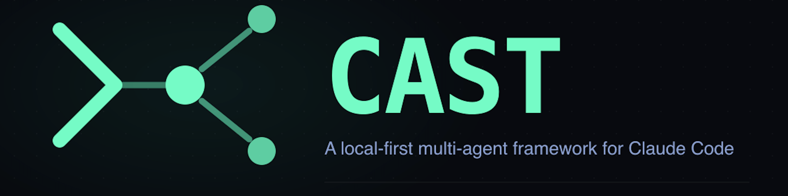

<p align="center">
  
</p>

<h1 align="center">CAST</h1>

<p align="center">
  <strong>A governance control plane for Claude Code.</strong><br>
  Claude Code keeps a transcript. CAST keeps a <em>record</em> — and then uses it.
</p>

<p align="center">
  <a href="https://github.com/ek33450505/claude-agent-team/actions/workflows/bats-ci.yml"></a>
  
  
  
  
  
</p>

<p align="center">
  <a href="docs/tutorial/getting-started.md">Quick Start</a> ·
  <a href="docs/architecture/ARCHITECTURE.md">Architecture</a> ·
  <a href="docs/agents/AGENT-ROSTER.md">Agent Roster</a> ·
  <a href="CHANGELOG.md">Changelog</a> ·
  <a href="https://castframework.dev">castframework.dev</a>
</p>

---

CAST is a governance layer for Claude Code: it records what your agents did, and enforces what they may do next.

Every dispatch, review, truncation and cost lands in a typed SQLite schema on your machine at
`~/.claude/cast.db` — <!-- CAST_DB_TABLE_COUNT -->43<!-- /CAST_DB_TABLE_COUNT --> typed tables that CAST provisions (a long-lived database
also carries tables from older migrations). That record is not a logbook —
it is the control plane. It gates your commits, recalls the incident you are about to re-cause, attributes
spend per task, and predicts how a dispatch will go before you make it.

Built entirely on Claude Code's native primitives — hooks, subagents, skills, permissions, MCP — with
<!-- CAST_AGENT_COUNT -->27<!-- /CAST_AGENT_COUNT --> specialist agents that plan, implement, review, test and commit. Raw `git commit` and
`git push` are hard-blocked by hooks, not by convention.

**Two things make it unusual:** it is *honest* — it tells you when work is unverified, and records its own
failures in their own tables — and it is *hard to make destroy itself*. Both were earned. A full `~/.claude`
wipe (twice, once taking colocated backups with it) and a destructive test that ran `rm -rf` from the repo
root became invariants in code, not lessons in a postmortem. CAST is deliberate about the limits of that
second claim: guards are hooks, and a session launched in a mode that skips hook discovery does not get
them. What that costs, and what still holds, is written down in
[docs/known-limitations.md](docs/known-limitations.md).

```console
$ cast status          # real layout; spend/memory values replaced with illustrative ones
CAST v10.2.0
======================================================================
Agents      27 in ~/.claude/agents/
Hooks       30 active
Spend       $12.40 today  $84.10 this week
Budget      $12.40 / $50.00 daily (24%)
Memory      1008 entries | 61 stale (confidence < 0.4) | last verified: 2026-08-26 08:13:46
======================================================================
Recent agents (last 5):
  ~ Explore                [                        ]
  + commit                 [claude-haiku-4-5-20251001] 5m ago
  + code-reviewer          [claude-haiku-4-5-20251001] 6m ago
  + frontend-writer        [claude-sonnet-5         ] 7m ago
  + test-runner            [claude-haiku-4-5-20251001] 8m ago
```

`+` is a clean `DONE`; `~` is still running; `x` is `BLOCKED` or `NEEDS_CONTEXT`. In-flight rows carry no
model or elapsed time yet — those are written at completion, so an empty pair means *running*, not *broken*.

> **Status.** Latest release **v10.2.0** (2026-09-10). **v10.3.0**, a security and reliability release
> hardening the exec path and the guards, is in close-out. Released history:
> [CHANGELOG.md](CHANGELOG.md).

---
## See it work

Three commands, real output.

**Ask what a task will cost — and who should do it.** Not a guess: an aggregate over your own history.

```console
$ cast predict "add a bats test for the git guard"
── Cost Prediction ──────────────────────────────────────────────────────
Tasks like this: ≈ $19.30 median  (mean $35.00, range $0.14–$254.95) over 49 similar sessions

── Suggested Agents ─────────────────────────────────────────────────────
  Suggested: commit                 (136 runs on similar tasks, 98% DONE, ≈$0.19 avg)
  Suggested: code-reviewer          (124 runs on similar tasks, 98% DONE, ≈$0.25 avg)
  Suggested: researcher             ( 94 runs on similar tasks, 65% DONE, ≈$1.93 avg)
```

**Ask your record in English.** FTS5 across every agent run, dispatch, transcript, memory, incident and
journal entry. `--semantic` adds local embeddings via Ollama. Nothing leaves the machine.

The index size is whatever your own history is — this README publishes no frozen figure, for the same
reason it publishes no frozen cost headline: retention prunes the rows underneath it. Measure yours:
`sqlite3 ~/.claude/cast.db "SELECT kind, COUNT(*) FROM record_fts GROUP BY 1 ORDER BY 2 DESC;"`

```console
$ cast ask "wipe incident" --limit 2
memory · 2026-07-09T21:40:50 · wipe-canary-quiet-log-is-healthy
   [wipe]-canary-quiet-log-is-healthy com.cast.[wipe]-canary's StandardOutPath…

agent_run · 2026-07-09T21:40:50 · researcher · DONE
   …including `[wipe]-canary-launchd.log`. It only writes to the [incident] directory…
```

**Know the state of your own system.** `cast doctor` prints one line per check and, since v10, exits non-zero
when something is actually wrong.

```console
$ cast doctor
[ok] Schema: 16/16 provisioned tables present
[ok] Hooks registered: 30 entries
[ok] Install integrity: manifest verified
[!!] Stale memories: 38 flagged (verified_at > 30 days, names specific paths/flags)
[ok] MCP servers: 3 configured, all reachable
[ok] Litestream: replica fresh (lag 0s)
[!!] Some checks need attention
$ echo $?
1
```

---

## What is in the box

`cast` is one binary with **41 subcommands** (`grep -cE '^  [a-z-]+\)' bin/cast`). The record is not a logbook you read — it is a surface you
query, and these are the queries.

| | |
|---|---|
| **Query the record** | `ask` · `predict` · `incidents` · `review` · `cost` · `budget` · `files` · `agents --usage` |
| **Enforce** | `doctor` · `integrity` · `db-contract` · `provenance` · `ledger` |
| **Run agents** | `dispatch` · `parallel` · `batch` · `exec` · `feature` · `test` · `eval` |
| **Operate** | `status` · `dash` · `hooks` · `routines` · `migrate` · `backup` · `restore` · `tidy` · `clean` |
| **Extend** | `new-agent` · `init-repo` · `rules` · `stack` · `memory` · `mcp` · `cheap` · `install-completions` |

A few worth calling out:

- **`cast dash`** — a live TUI. `htop`, but for your agents.
- **`cast cheap`** — route a whole session to a local model through
  [claude-code-router](https://github.com/musistudio/claude-code-router) + Ollama. Verified here on
  `qwen2.5:7b`. Cheap mode is opt-in and per-session; `claude` still uses the API.
- **`cast ledger`** — a signed, per-session audit receipt, renderable to a file and re-verifiable with
  `--verify`.
- **`cast mcp serve`** — expose your own record read-only over MCP, so any Claude Code session can query it:
  `claude mcp add cast-record -- cast mcp serve`.
- **`cast ci-local`** — run the PR-gating CI workflows locally via `act` before you push.
- **`cast routines`** — scheduled agent jobs (briefings, cost reports, integrity monitors) via launchd.

---

## Five things you will not find elsewhere

**1. The record predicts.** `cast predict` reads outcomes, not intentions: median cost, spread, and which
agents actually finished this kind of work. Most observability tells you what happened. This tells you what
is *about to*.

**2. Escape hatches are a recorded primitive, not an honor system.** Every guarded git operation has a
hatch — and as of v10 all 17 git hatches write a row to `ack_events` when, and only when, the hatch actually
averted a block. `CAST_HATCH_REASON="rebasing onto main"` records *why*. The command-guard hatches
(`CAST_KILL_OK`, `CAST_RM_OK`, `CAST_PROTECTED_WRITE_OK`) are logged as block lines, not recorded in
`ack_events`. Bypassing a gate is allowed; doing it invisibly is not.

**3. It records its own failures in their own tables.** `agent_hallucinations`, `agent_truncations`,
`completeness_events`, `hook_failures`, `agent_protocol_violations`. When a hook breaks it writes a row
instead of swallowing the error — so the failure is data, not silence.

**4. It is hard to make it destroy itself.** Two full `~/.claude` wipes (one taking colocated backups with
it) and a destructive test that ran `rm -rf` from the repo root became invariants in code. Litestream
replicates outside the blast radius; the wipe canary runs from that isolated path so it survives the event
it detects; `blast-radius-lint` fails CI on a bare `rm -rf` in `scripts/`.

**5. Everything is local and inspectable.** SQLite you can open with `sqlite3`. Markdown agents you can
read in an editor. Hooks that are shell scripts. No SaaS, no telemetry, no sign-in — and no magic you
cannot `cat`.

---

## Installation

**Homebrew**

```bash
brew tap ek33450505/cast && brew install cast
bash "$(brew --prefix)/opt/cast/libexec/install.sh"   # sets up ~/.claude, cast.db, hooks
```

**From source**

```bash
git clone https://github.com/ek33450505/claude-agent-team.git
cd claude-agent-team && bash install.sh
```

**As a Claude Code plugin** — dual-ship; the plugin coexists with `install.sh` rather than replacing it.

```bash
/plugin marketplace add ek33450505/claude-agent-team
/plugin install cast@cast
/plugin enable cast@cast
```

The plugin is **opt-in** (`defaultEnabled: false`): until you run `/plugin enable`, the SessionStart
bootstrap does not run. `install.sh` stays authoritative for the runtime layer (`~/.claude/scripts`,
`cast.db`, launchd jobs, git hooks — deployed to `~/.claude/githooks`, which `core.hooksPath` points at, so
after editing `.githooks/` re-run `install.sh`); when both are present the plugin's hooks defer via a
`~/.claude/config/cast-hook-owner` sentinel so nothing double-fires.

The plugin ships **22 curated agents** — `push` (needs the install.sh runtime) and `morning-briefing` are
excluded. Add the 3 opt-in extras with `bash scripts/gen-plugin.sh --with-extras dist/cast-plugin`. A full
`install.sh` carries all <!-- CAST_AGENT_COUNT -->27<!-- /CAST_AGENT_COUNT -->.

Then: `cast status` to verify, and **[the 5-minute tutorial](docs/tutorial/getting-started.md)** to run your
first gated dispatch.

---


## Built on Claude Code's primitives

CAST is a layer over Claude Code, not a replacement for it. Each row names the native primitive first, then what CAST adds.

| Native primitive | What Claude Code gives you | What CAST adds |
|---|---|---|
| [Hooks](https://code.claude.com/docs/en/hooks) | Lifecycle events delivered as JSON to your commands. | Recorders that write typed rows to `cast.db`, an injection path back into the next turn, and guards that block before a tool call lands. |
| [Subagents](https://code.claude.com/docs/en/sub-agents) | Markdown agent definitions with their own tools and model. | A <!-- CAST_AGENT_COUNT -->27<!-- /CAST_AGENT_COUNT -->-agent roster with model tiering (Haiku 16 / Sonnet 10 / Opus 1), a typed Handoff/Status contract, truncation detection. |
| [Settings](https://code.claude.com/docs/en/settings) & [permissions](https://code.claude.com/docs/en/permissions) | Allow/deny rules and layered settings files. | Path-tier command guards glob rules cannot express; agent edits to CAST's runtime and project settings denied; a `ConfigChange` guard blocks hot-reloaded `env`/`disableAllHooks`. |
| [Sandbox](https://code.claude.com/docs/en/sandboxing) | An OS-level boundary for Bash. | Guards that do not depend on it; for users who enable it, write-denies on git-executed paths and `git`, `docker`, `bq`, `osascript` removed from `excludedCommands`. |
| [Plan mode](https://code.claude.com/docs/en/common-workflows) | Plan-then-act in a single session. | Native plan mode is the default; the `planner` and `/orchestrate` chain is reserved for multi-agent work. |
| [Skills](https://code.claude.com/docs/en/skills) & [plugins](https://code.claude.com/docs/en/plugins/overview) | On-demand instruction bundles and a distribution format. | Rules moved into on-demand skills; dual-ship as a native plugin alongside `install.sh`. |
| [MCP](https://code.claude.com/docs/en/mcp) | A standard way to expose tools and data. | `cast mcp serve` exposes the record read-only. |

The guards are a string-analysis defence-in-depth layer; the sandbox is the hard OS boundary. The maintainer
runs with the sandbox off by choice, and the residuals are listed in
[docs/known-limitations.md](docs/known-limitations.md) and
[docs/architecture/enforcement-awareness-split.md](docs/architecture/enforcement-awareness-split.md). The
design rule (adopt native, delete bespoke) is explained in the next section.

---


## Why CAST exists

Observability systems produce data, and data alone is powerless. The record only matters when it *acts* —
when it changes the next decision. CAST inverts the usual stack: instead of *instrument → ship → hope
someone reads a dashboard*, it runs **record → query → inject → enforce**.

The native primitive underneath is **hooks**. Claude Code fires structured JSON on `SessionStart`,
`UserPromptSubmit`, `PreToolUse`, `PostToolUse`, `SubagentStop` and `Stop`. CAST wires each as a recorder
that writes a typed row — and wires `UserPromptSubmit` as the *injection* path that feeds prior rows back
into the next turn.

CAST is candid about where that stops being special. The hooks-as-recorders mechanism is native plumbing;
any plugin could subscribe to the same events. What a generic plugin cannot produce is the **content**.
`dispatch_decisions`, `provenance_chain`, `quality_gates`, `injection_log`, `incidents` — those rows do not
exist in vanilla Claude Code because the *events* do not exist there. They are the exhaust of a governance
architecture, and a record is only ever as rich as the events its host emits.

That drives the design rule: **where Claude Code ships a native primitive, adopt it and delete the bespoke
version.** Language rules became on-demand skills; the mandatory planner chain yielded to native plan mode
for single-session work; distribution moved to a native plugin. The framework got *smaller*.

Run that subtraction honestly and most of CAST melts into the platform — the skills loader, the MCP adapter
(Anthropic's own reference SQLite MCP server could serve `cast.db` too), the agent roster and its model
tiering, the statusline, and backups (already delegated to Litestream). What survives is narrower than a
pitch would like: the governance-semantic **content** of the record, the cross-surface joins over it, and the
honesty doctrine rendered executable. A system candid about what it does *not* uniquely provide is one you
can check on everything else.

---


## What it enforces

**Guards that bite.** Raw `git commit` and `git push` are blocked by PreToolUse hooks
(`scripts/cast-git-guard.py`) — no honor system, no flag you can quietly ignore. Commits route through a
`commit` agent that records provenance, and a pre-push gate audits that every commit traces to a recorded
session. Destructive operations (`rm -rf` of protected roots, `pkill`) are blocked by a command-guard with
path-tier specificity that native glob permissions cannot express. A Bash write guard (RULE 5 in
`scripts/cast-command-guard.py`, hatch `CAST_PROTECTED_WRITE_OK=1`) hard-blocks Bash that writes into the
installed exec surface (`~/.claude/{githooks,scripts,config}`, the install manifest, the `~/Library` python
caches and LaunchAgents); deploy goes through `bash install.sh`. The git guard also blocks exec-capable
`git config` keys, `git gc`/`maintenance`/`worktree prune` and symlinked worktree entries. The git guard
fails **closed** when it cannot load or check a call, the Bash guards run under a watchdog that blocks when
they cannot finish, and a missing installed policy config blocks Write/Edit. (The command guard itself still
allows on an internal error — a crash there must not block every Bash call.)

**Review you cannot skip.** Code changes mandate a fresh-context `code-reviewer` gate, enforced in the agent
registry rather than in your discipline. The commit gate reads `quality_gates` to decide whether a change was
actually reviewed — and a rejection is *sticky*, so a later approval cannot silently clear it.

**The system audits itself.** A `SubagentStop` hook parses each agent's typed `## Handoff` contract, detects
truncation (an agent cut off mid-task is flagged, never relayed as done), checks claimed work against real
file changes, and records what it finds in `agent_hallucinations` and `agent_truncations`. When a hook fails,
it writes to `hook_failures` instead of swallowing the error. An install-integrity manifest
(`~/.claude/install-manifest.sha256`) is verified at every SessionStart and by `cast doctor`, bytecode caches
included, and raises an alarm when an installed hook or guard file, its mode, or git config drifts.

**No false green.** `cast doctor` prints one line per check and reports what is actually wrong — stale backups, an
unloaded canary, a non-writable evidence path — rather than a green tick. Separately,
`scripts/cast-lint-write-only-tables.py` parses every `CREATE TABLE` and searches the source for a matching
read site, so a table that is written but never read gets named. It is deliberately **advisory** — it always
exits 0 and cannot break CI — because the honest response to "we collect this and never read it" is a
decision, not a build failure.

**It cannot destroy its own runtime.** Backups replicate via [Litestream](docs/backups.md) to
`~/Library/Application Support/cast/` — deliberately off the `~/.claude` blast radius. The wipe canary runs
from that same isolated path, so it survives the event it detects. A `blast-radius-lint` ratchet fails CI on
any bare `rm -rf` in `scripts/`. Every test that touches `$HOME` isolates to a temp one — never the real
directory. Destructive operations are tested by proving they **refuse**, not merely that they succeed.

**Local-first by construction.** Code, prompts, memory and the full audit trail live on your disk. No SaaS,
no telemetry egress, no sign-in. Cloud features — Managed Agents, local-model routing via
[claude-code-router](https://github.com/musistudio/claude-code-router) — are additive and opt-in. *A CAST
user with no network still has a fully working system.*

---


## Architecture

A user prompt is routed by `CLAUDE.md`; **PreToolUse guards** block non-compliant actions before they land;
the **typed agent registry** dispatches to the right model tier; a **mandatory `code-reviewer` gate** reviews
in fresh context; **SubagentStop** validates the Handoff, runs honesty sensors and writes memory; and every
step appends to `cast.db` — which Litestream replicates outside the blast radius.

<p align="center">
  
</p>

Full guide: **[docs/architecture/ARCHITECTURE.md](docs/architecture/ARCHITECTURE.md)**.

---


## Agents

<!-- CAST_AGENT_COUNT -->27<!-- /CAST_AGENT_COUNT --> core specialists, each a markdown file in `~/.claude/agents/` with YAML frontmatter defining
model tier, memory, isolation and effort. Responses validate against JSON schemas in `schemas/`, including
the typed `## Handoff` contract. Model tiering is deliberate: Haiku 16 / Sonnet 10 / Opus 1 — the escalation
bar is irreversibility plus infrequency, not raw difficulty.

`frontend-writer` · `backend-writer` · `code-reviewer` · `debugger` · `planner` · `researcher` · `security` ·
`test-writer` · `commit` · `push` · `devops` · `bash-specialist` · `migration-reviewer` · `eval-writer` ·
`pr-reviewer` — and 12 more.

Ceremony matches task size: a trivial edit just gets made (code still routes to a specialist — "no plan"
never means "no review"); one-or-few files use native plan mode with a single agent; genuinely multi-file
work runs the `planner` → `/orchestrate` chain in waves. Full table with tiers:
**[docs/agents/AGENT-ROSTER.md](docs/agents/AGENT-ROSTER.md)**.

---


## Hooks

Deterministic `command`-type hooks enforce; `prompt`-type hooks advise. The lifecycle: **SessionStart**
(bootstrap + context banner + install-integrity check) → **UserPromptSubmit** (memory recall + routing) →
**PreToolUse:Bash** (commit/push/stash block, `pkill` and `rm -rf` command-guard, exec-surface write guard) → **PreToolUse:Write|Edit** (write-guards +
reviewer injection) → **PostToolUse** → **SubagentStop** (truncation detection, Handoff validation, honesty
sensors, memory write) → **PostCompact** → **SessionEnd** (memory distiller).

Write your own: **[docs/hooks/authoring-guide.md](docs/hooks/authoring-guide.md)**.

---


## The record

SQLite in WAL mode at `~/.claude/cast.db` — append-only, never truncated, fully local.
<!-- CAST_DB_TABLE_COUNT -->43<!-- /CAST_DB_TABLE_COUNT --> typed tables covering sessions, agent runs, routing events, quality gates,
dispatch decisions, memories, eval runs, incidents and provenance.

```bash
cast ask "why did the push gate block me"   # FTS5 over the whole record
cast predict "add auth to the API"          # past outcomes → cost and success rates
cast cost --by-task                         # attribute spend per unit of work
cast mcp serve                              # read-only MCP server over the record
```

Register the record with any Claude Code session:
`claude mcp add cast-record -- cast mcp serve` — read-only stdio, `mode=ro`, no arbitrary SQL.

Two read-only UIs surface it: **[claude-code-dashboard](https://github.com/ek33450505/claude-code-dashboard)**
(React 19 + Vite + Express, ~21 views) and **[Cast Desktop](https://github.com/ek33450505/cast-desktop)**
(Tauri 2 native macOS app with an embedded PTY terminal). Both read `cast.db` locally — no cloud.
See [docs/observability/OBSERVABILITY.md](docs/observability/OBSERVABILITY.md).

**Memory.** Each agent accumulates domain knowledge in `~/.claude/agent-memory-local/<name>/MEMORY.md`
(native auto-load), alongside a per-prompt router over the `agent_memories` table (FTS5 relevance +
confidence scoring). A weekly routine decays, dedups, archives and promotes — confidence-gated and
usage-aware, so a memory recalled often decays slower than one nobody reads.

---


## Testing

<!-- CAST_TEST_FILE_COUNT -->260<!-- /CAST_TEST_FILE_COUNT --> BATS test files (<!-- CAST_TEST_COUNT -->4566<!-- /CAST_TEST_COUNT --> test cases) covering hooks, migrations,
guard logic, event emission and memory persistence — including tests that prove destructive operations
**refuse**. Runs on macOS and Ubuntu in CI.

```bash
bash tests/run.sh          # the CI-glob runner
```

> **Hard rule:** every test that touches `$HOME` isolates to a temp one, and GUI side effects are stubbed.
> **Never run the suite against your real `~/.claude`.** That rule was born from a wipe. Use `tests/run.sh`
> — it expands the same five-pattern glob CI uses, whereas plain `bats tests/` is non-recursive and silently
> skips every subdirectory test.

CAST needs **bats-core ≥ 1.10**, not the legacy `bats` package: `brew install bats-core` on macOS,
`npm install -g bats` (or a source install) on Debian/Ubuntu. Verify with `bats --version`. Details:
[docs/compatibility.md](docs/compatibility.md).

macOS and Ubuntu are both covered in CI, by different workflows — the badge above tracks the Ubuntu suite;
macOS runs via the installer workflow.

**Agent behavior is tested too.** `cast eval` runs a corpus in `evals/cases/<agent>/*.yaml` mined from real
failures — missed bugs, false `DONE`s, ignored scope — with three-outcome graders (a grader that cannot
decide never false-fails), an LLM-judge grader, and `pass@k` for probabilistic behavior.

```bash
cast eval list && cast eval run --all && cast eval report
```

---


## Cost, measured honestly

`cast cost` attributes tokens and dollars per task, branch and agent, and model tiering keeps review-class
work off the expensive tier. The main-loop model defaults to `claude-sonnet-5`, which matters more than it
sounds: Workflow, Explore, Plan and general-purpose subagents **inherit whatever model drives the main loop**,
so one setting moves the largest recorded cost driver off Opus by default.

CAST deliberately publishes **no frozen cost headline**. Figures computed over a rolling window go stale the
moment retention prunes the rows behind them — this project retired one such number for exactly that reason.
Measure your own instead, and note the span:

```bash
just -g window     # print the real retained span FIRST — a share means nothing without it
just -g cost       # spend by agent
just -g model-mix  # tier distribution
```

One historical measurement, stated with its window and **not reproducible today** — the rows behind it have
since been pruned, which is the same reason the earlier headline figure was retired. Over **2026-06-12 →
06-30, across 4,762 recorded runs**, `agent_runs` showed an **~86.6% cache-read share** of input-side tokens.
Valued against re-sending the same context fresh (a cache read bills at 0.1× base input), that is
**~$7,920 avoided** — Sonnet $3,863, Opus $3,010, Haiku $1,047 — computed from recorded token counts times
then-current prices. It was an attributable *floor*: it excluded off-policy and legacy-alias rows whose cache
reads were never recorded. ⚠️ Treat it as a dated artifact, not a live claim — and note the derivation lives
only here, so it cannot be re-checked against the record.

The honest caveat that most portfolios would omit: **CAST does not create that saving.** Prompt caching is an
automatic platform feature; vanilla Claude Code gets it with no CAST involvement, and the figure is a
counterfactual, not cash. What CAST contributes is narrower and real — **legibility** (turning an opaque
platform discount into an auditable number) and **session shape** (slim always-on rules, demand-loaded
skills, and stable memory injection engineer a larger, stabler cacheable prefix). The second is genuine but
unquantified: no controlled baseline separates CAST-shaped cache hits from hits that would have happened
anyway. See [docs/TOKEN-OPTIMIZATION.md](docs/TOKEN-OPTIMIZATION.md).

---


## Documentation

| Guide | What's in it |
|---|---|
| [Tutorial](docs/tutorial/getting-started.md) | Install, verify, run your first gated dispatch |
| [Architecture](docs/architecture/ARCHITECTURE.md) | Control plane, enforcement, data-integrity stack, evals |
| [Agent Roster](docs/agents/AGENT-ROSTER.md) | All <!-- CAST_AGENT_COUNT -->27<!-- /CAST_AGENT_COUNT --> agents with model tiers and scope |
| [Backups & Recovery](docs/backups.md) | Litestream, off-radius snapshots, `cast integrity` |
| [Hook Authoring](docs/hooks/authoring-guide.md) | Write, test and install custom hooks |
| [Observability](docs/observability/OBSERVABILITY.md) | cast.db schema and the dashboards |
| [Routines](docs/routines.md) | Scheduled agent jobs — briefings, cost reports, integrity monitor |
| [Compatibility](docs/compatibility.md) | Claude Code version requirements and known breakages |
| [Known Limitations](docs/known-limitations.md) | What CAST cannot do, and why |
| [Full Docs Index](docs/README.md) | Everything, with one-line descriptions |

CAST ships <!-- CAST_COMMAND_COUNT -->21<!-- /CAST_COMMAND_COUNT --> slash commands and <!-- CAST_SKILL_COUNT -->19<!-- /CAST_SKILL_COUNT --> on-demand skills.


---


## Ecosystem

CAST is the core of a connected set of open-source repositories, each solving one piece of the multi-agent
workflow problem.

<!-- ECOSYSTEM_START -->
| Tier | Repos |
|---|---|
| Observability | claude-code-dashboard, cast-desktop |
| Record extractions | cast-mcp, cast-ledger, cast-predict |
| Tooling | cast-memory, cast-doctor, cast-time, cast-claudes_journal |
<!-- ECOSYSTEM_END -->

Full table and install commands: **[docs/ecosystem.md](docs/ecosystem.md)**.

---


## Contributing

Contributions are welcome — CAST is developed in the open. New agents, shell fixes, BATS coverage and
documentation improvements are all fair game. Please open an issue before non-trivial changes, and read
**[CONTRIBUTING.md](CONTRIBUTING.md)** for the workflow (including how to regenerate the plugin artifact).

Questions and ideas: **[GitHub Discussions](https://github.com/ek33450505/claude-agent-team/discussions)**.

---


## License

MIT — see [LICENSE](LICENSE).

Built and maintained by **[Edward Kubiak](https://github.com/ek33450505)**, full-stack engineer — CAST is
the system I wanted for building software with Claude Code every day, so I built it, broke it, and hardened
it until it earned trust. [castframework.dev](https://castframework.dev) ·
[edwardkubiak.com](https://edwardkubiak.com)
