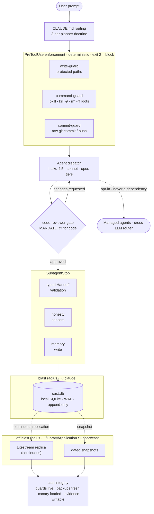

# CAST Architecture

> The v8 ("Native CAST") control plane. See also: [Protocol Spec](cast-protocol-spec.md) · [Backups & Recovery](../backups.md) · [README](../../README.md)

CAST is a **control plane for Claude Code** — a layer of deterministic enforcement, local observability, and data-integrity guarantees that sits around the agent loop. It is built on two structural convictions, not conventions:

1. **Local-first by construction** — the core development loop never has to leave the machine. Your code, prompts, memory, and the full audit trail (`cast.db`, SQLite) live on your disk. Every cloud capability (Managed Agents, cross-LLM routing) is strictly opt-in and is never a dependency of the core loop.
2. **Data integrity by construction** — earned through repeated full `~/.claude` wipes. Backups live *outside* the failure domain they protect, the failure detector lives outside the blast radius too, and CAST is structurally prevented from destroying its own runtime.

The rest of this document maps the v8 surface: the request lifecycle, the enforcement gates, the data-integrity stack, the typed agent contracts, the eval harness, the plugin packaging, and the memory subsystem.

---

## The v8 Control Plane (request lifecycle)

Every operation flows through the same gated pipeline. Deterministic `command`-type hooks enforce; the model routes; a fresh-context reviewer gates code; and the local database records everything — with replication crossing the blast-radius boundary so the evidence survives the machine.

> The diagram source of truth is [`cast-architecture.mmd`](cast-architecture.mmd); regenerate the PNG/SVG export with `bash scripts/gen-arch-diagram.sh`.

---

## Hook lifecycle

CAST wires the Claude Code hook surface into a single enforcement-and-observability pipeline. The load-bearing gates are `command`-type hooks (deterministic — they can block); `prompt`-type hooks are advisory.

| Event | Script(s) | Role |
|---|---|---|
| `SessionStart` | `cast-session-start.sh`, `cast-plugin-bootstrap.sh` | Bootstrap runtime dirs / symlinks / `cast.db`; inject the journal + context banner |
| `UserPromptSubmit` | `cast-user-prompt-hook.sh` → `cast-memory-router.py`, `route.sh` | Per-prompt memory recall (FTS5) + intent routing |
| `PreToolUse: Bash` | `pre-tool-guard.sh`, `cast-command-guard.sh` | Block raw `git commit`/`push`/`stash`; block process-kills + `rm -rf` of protected roots |
| `PreToolUse: Write\|Edit` | `write-guards.sh`, `pre-tool-guard.sh` | Block writes outside the declared blast radius; inject `[CAST-REVIEW]` after code edits |
| `PostToolUse` | `post-tool-hook.sh` | Lifecycle event emission → `cast.db` |
| `SubagentStop` | `cast-subagent-stop-hook.sh` → `cast_handoff_parser.py` | Truncation detection, typed Handoff validation, honesty sensors, memory write |
| `PostCompact` | `cast-precompact-guard.sh` | Preserve state across context compaction |
| `SessionEnd` | `cast-session-distiller.py` | Distill user-prose memory candidates to the review queue |
| `StopFailure` / `CwdChanged` | `cast-stop-failure.sh`, hook | Log mid-task API failures; export `CAST_REPO_CLASS` per repo |

---

## Enforcement: write-guards + command-guard

Two deterministic PreToolUse gates make destructive actions structurally impossible, not merely discouraged. Both exit `2` to hard-block and surface the reason to **stderr** (Claude Code shows hook stderr on a PreToolUse block).

- **Write-guards** (`scripts/write-guards.sh` / `write-guards.py`) protect the filesystem write surface: a literal-tilde path (the plan-mode `~`-as-a-directory bug) and any write that resolves to a protected root are refused. *(This guard caught a real harness bug while this very release was being planned.)*
- **Command-guard** (`scripts/cast-command-guard.py` / `.sh`) is the command-layer analogue, added in v8 after an agent ran a machine-wide `pkill`. It blocks mass process-kills (`pkill`/`killall`, `kill -9 -1`, `kill 0`, `kill -- -N`) and recursive-force deletes of protected roots (`/`, `/*`, `$HOME`, the resolved home, and the `~/.claude` subtree), while allowing scoped single-PID kills and ordinary deletes. Per-segment escape hatches `CAST_KILL_OK=1` / `CAST_RM_OK=1` exist for deliberate use; the guard fails open (a parse error never blocks legitimate work).

Both guards fire for **native Agent-tool subagents** — verified empirically: in-session subagents run with `CLAUDE_SUBPROCESS` unset, so the guards are not skipped (see [protocol-spec §2.5](cast-protocol-spec.md)).

The complementary repo-time gate is **`blast-radius-lint.sh`**: any bare `rm -rf` / `shutil.rmtree` in `scripts/` is a CI/pre-commit violation unless it routes through the shared `cast_safe_rm` / `safe_rmtree` guard primitives — the rule is "declare your blast radius; be guarded to it."

---

## Data-integrity stack

Pillar 2 made into infrastructure. The invariant: **a CAST operation may never delete or overwrite outside its declared scope, and the evidence of a failure must outlive the failure.**

- **Litestream** continuously replicates `cast.db` to `~/Library/Application Support/cast/` — *outside* the `~/.claude` blast radius — via the `com.cast.litestream` LaunchAgent. Near-zero RPO; closes the colocated-backup hole that a wipe exposed.
- **Dated snapshots** (`cast-snapshot.py`, 7-day + 4-week retention) land off-radius as well; `cast backup` drives them.
- **Wipe canary** lives at `~/Library/Application Support/cast/bin/` (relocated off the blast radius) so it captures forensics at the instant `~/.claude` vanishes — the detector cannot be deleted by the event it detects.
- **Migration backup-gate** — `cast-migrate.py --confirm` takes a fail-closed `cast.db` backup before any destructive migration; `cast-db-prune.py` backs up before its scheduled DELETE.
- **`cast integrity`** is the read surface — an honest ladder that answers "are my guarantees live *right now*?": write-guards present · blast-radius lint wired · backups fresh and off-radius · Litestream replica fresh · canary loaded · evidence path writable. It never reports green on absent evidence. A daily `com.cast.integrity` LaunchAgent notifies only when the warn count *rises* above a stored baseline.

Destructive paths are tested by **proving refusal** (the guard refuses and logs), not just by proving the happy path.

---

## Typed Handoff contract

In a multi-agent chain, each agent emits a `## Handoff` block — the machine-readable contract the orchestrator injects into the next agent's prompt. v8 promotes it from prose to a JSON schema, [`schemas/agent-handoff.json`](../../schemas/agent-handoff.json):

- **Required:** `files_changed`, `status` (`DONE` | `DONE_WITH_CONCERNS` | `BLOCKED`), `blockers`.
- **Optional:** `agent`, `key_decisions`, `next_agent_needs`.

`scripts/cast_handoff_parser.py` validates the block inside the `SubagentStop` hook — **WARN-only, never blocking** — and logs violations to `agent_protocol_violations`. A missing block is only flagged for chained (batch) agents, so solo dispatches never produce false positives. This kills the "Handoff key missing → silent cascade failure" class.

---

## Eval harness

CAST has 1,000+ BATS *script* tests but, until v8, **zero agent-behavior evals** — the largest documented gap versus Anthropic's own guidance. The `cast eval` harness closes it.

- **Cases** live in `evals/cases/<agent>/*.yaml`, mined from *real* CAST failures (missed bugs, false `DONE`s, ignored scope, regressions).
- **Graders** are three-outcome (confirmed / unverified / refuted — a grader that can't decide never false-fails): programmatic graders plus an **LLM-judge** grader (`haiku`, `CAST_EVAL_JUDGE_CMD`-injectable) for behavioral cases.
- **`pass@k`** (cost-tier `k = 1/3/5`, `--expensive`) measures flaky/probabilistic behavior.
- Runs land in the **`eval_runs`** table; `cast eval run|list|report|record` drive and read them. The `eval-writer` agent produces graders, not stubs.

---

## Plugin packaging (dual-ship)

v8 ships CAST as a **native Claude Code plugin** — the headline "less bespoke, more platform" move and the breaking change behind the major version bump. It is **DUAL-SHIP**: the plugin coexists with `install.sh` rather than replacing it.

- `scripts/gen-plugin.sh` generates a **curated** build: 17 "lean" agents (`push` + `morning-briefing` excluded — the former needs the install.sh runtime; the latter's `permissionMode` is illegal in a plugin agent), `+4` opt-in extras via `--with-extras`. Skills are PII-stripped; commands get frontmatter injected; `hooks/hooks.json` is derived from `managed-settings.d/` (the single source of truth) with `~/.claude/scripts` → `${CLAUDE_PLUGIN_ROOT}/scripts` rewrites.
- The committed artifact lives at repo-root `plugin/`, exposed via `.claude-plugin/marketplace.json`. `scripts/check-plugin-drift.sh` is a CI gate that regenerates and asserts the committed `plugin/` is byte-identical (and runs `claude plugin validate --strict`).
- `install.sh` stays **authoritative for the runtime layer** (`~/.claude/scripts`, `cast.db`, launchd jobs, git hooks). When both installs coexist, the plugin's command hooks defer to install.sh via a `~/.claude/config/cast-hook-owner` sentinel, so hooks never double-fire (`cast doctor` check #23 detects double-wiring).

See [`docs/v8-a1-plugin-p0-findings.md`](../v8-a1-plugin-p0-findings.md) for the empirical validation (`${CLAUDE_PLUGIN_ROOT}` substitution, command-hook firing from a plugin, MCP via `${user_config.*}`).

---

## Rules → on-demand skills

To make the conventions plugin-portable, v8 migrated language-specific rules (TypeScript, Python) into demand-loaded **skills** (`typescript-conventions`, `python-conventions`, `agent-registry`) wired into the agents that need them. Behavioral rules and the HARD-RULE files (`working-conventions`, `shell.md`, `tests.md` — which carry the temp-HOME and GUI-isolation test rules) stay always-on. The retirement is **DUAL-KEEP**: rules-core is retained until the skill path is proven in. See [`docs/v8-a1-rules-migration.md`](../v8-a1-rules-migration.md).

---

### Where CAST extends Claude Code

| Claude Code (native) | CAST (on top) | Design rationale |
|---|---|---|
| Plugins, agents, skills, hooks | Curated dual-ship plugin + install.sh runtime; deterministic `command`-hook enforcement | Native distribution, but with gates the platform leaves advisory |
| Per-session model selection | Per-task routing across haiku 4.5 / sonnet / opus tiers | Automatic cost/capability matching |
| No persistent audit trail | `cast.db`: <!-- CAST_DB_TABLE_COUNT -->39<!-- /CAST_DB_TABLE_COUNT -->+ tables — sessions, agent_runs, routing_events, quality_gates, agent_memories, eval_runs, agent_protocol_violations, and more, with temporal indices | Queryable, immutable, **local** run history |
| No backup/recovery story | Litestream off-radius replication + dated snapshots + wipe canary + `cast integrity` | Data integrity by construction |
| No cross-agent messaging | Peer gossip protocol (cast.db message bus) | Agents collaborate without a central broker |
| Prose agent output | Typed Handoff JSON schema + Structured Output schemas (`schemas/`) | Machine-readable agent contracts; no silent cascade failures |
| No agent-behavior testing | `cast eval` harness (real-failure corpus, LLM-judge graders, pass@k) | Closes Anthropic's largest documented gap |
| No visual observability | claude-code-dashboard (React 19 + Vite + Express) + cast-desktop (Tauri 2) | Live, local-only session/agent/hook insight |

---

## Memory Pipeline

CAST persists agent-discovered knowledge across sessions via `cast-memory-router.py`:

**Save flow (SubagentStop hook):** an agent emits a `## Facts` block (pipe-delimited `name | type | content`); the SubagentStop hook extracts it; `cast-memory-router.py` validates each entry (slug name, known type, ≤500-char content) and upserts to `agent_memories` in `cast.db`. Malformed lines are skipped silently.

**Retrieval flow (SessionStart / UserPromptSubmit hooks):** `cast-user-prompt-hook.sh` calls `cast-memory-router.py --query` with the prompt text; the router searches `agent_memories` (FTS5) and injects high-confidence entries into context. Agents also read their own `~/.claude/agent-memory-local/<agent>/MEMORY.md` at task start.

**Memory types:** `user`, `feedback`, `project`, `reference`, `procedural`.

### Two-tier memory model

CAST runs two memory tiers in parallel by design:

| | Tier 1 — Native auto-memory | Tier 2 — Dynamic router |
|---|---|---|
| **Mechanism** | Platform-level MEMORY.md auto-load | `cast-memory-router.py` via `UserPromptSubmit` hook |
| **Timing** | Session start only (static) | Per-prompt (dynamic) |
| **Source** | `memory/MEMORY.md` + `agent-memory-local/<agent>/MEMORY.md` | `agent_memories` table (FTS5-indexed) |
| **Scope** | First ~200 lines loaded by the platform | Top-N entries scored by FTS relevance + confidence |
| **Write path** | Direct file edits / auto-memory | `## Facts` block → SubagentStop hook → router upsert |

**Preferred WRITE path for new agent memories:** `agent-memory-local/<agent>/MEMORY.md` (Tier 1, no DB dependency). Tier 2's per-prompt FTS retrieval has no native equivalent yet, so both tiers coexist until the platform exposes a dynamic per-prompt context-injection API.
