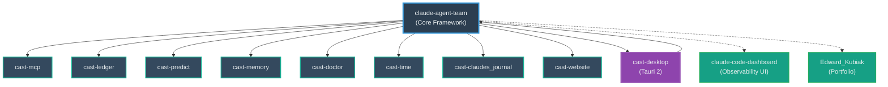

# CAST Ecosystem

> Canonical reference for all CAST repositories. Last updated: 2026-07-01 — ecosystem consolidation: 7 fragment repos archived, 3 record extractions added (13 taps → 9 packages).

## Core Framework

| Repo | Description | Latest | Install |
|---|---|---|---|
| [claude-agent-team](https://github.com/ek33450505/claude-agent-team) | Local-first multi-agent control plane. Specialist agents, quality gates, hook enforcement, cast.db audit trail. |  | `brew tap ek33450505/cast && brew install cast` |

## Standalone Packages

<!-- Note: cast-* version badges read from /ecosystem-versions.json (auto-generated by scripts/gen-ecosystem-versions.sh from each repo's VERSION/package.json). Do not hand-edit the versions — run the generator. -->
<!-- ECOSYSTEM_START -->
| Repo | Description | Latest | Install |
|---|---|---|---|
| [cast-mcp](https://github.com/ek33450505/cast-mcp) | Read-only MCP server over the Claude Code execution record (cast.db) — dispatch decisions, incidents, cost, sessions, and full-text search as 5 MCP tools + 5 resources. stdlib-only, strictly read-only. |  | `brew tap ek33450505/cast-mcp && brew install cast-mcp` |
| [cast-ledger](https://github.com/ek33450505/cast-ledger) | Signed, hash-chained, tamper-evident session receipts for Claude Code — SHA-256-stamped audit receipts from cast.db with `--verify`, plus an optional provenance hash-chain across sessions. |  | `brew tap ek33450505/cast-ledger && brew install cast-ledger` |
| [cast-predict](https://github.com/ek33450505/cast-predict) | Telemetry-driven dispatch prediction for Claude Code — reads cast.db to predict a task's likely cost, suggest agents, and surface related past incidents before you run it. |  | `brew tap ek33450505/cast-predict && brew install cast-predict` |
| [cast-memory](https://github.com/ek33450505/cast-memory) | Persistent agent memory for Claude Code — FTS5 full-text search, weighted relevance, temporal validity, Ollama embeddings, and weekly consolidation over cast.db. |  | `brew tap ek33450505/cast-memory && brew install cast-memory` |
| [cast-doctor](https://github.com/ek33450505/cast-doctor) | Standalone read-only health check for any Claude Code install — validates hooks, MCP config, agent frontmatter, cast.db core schema, and stale memories without the full CAST framework. |  | `brew tap ek33450505/cast-doctor && brew install cast-doctor` |
| [cast-time](https://github.com/ek33450505/cast-time) | Gives Claude Code a clock — injects local time, timezone, and a semantic time-of-day bucket at every SessionStart. |  | `brew tap ek33450505/cast-time && brew install cast-time` |
| [cast-claudes_journal](https://github.com/ek33450505/cast-claudes_journal) | Three-hook journaling for Claude Code (Stop/SessionStart/UserPromptSubmit) — maintains Claude's perspective and working memory across sessions as Obsidian-compatible markdown in ~/Documents/Claude/. |  | `brew tap ek33450505/homebrew-claudes-journal && brew install claudes-journal` |
| [cast-website](https://github.com/ek33450505/cast-website) | castframework.dev — marketing site and docs portal for the CAST ecosystem. |  | — |
| [cast-desktop](https://github.com/ek33450505/cast-desktop) | Tauri 2 native app — embedded PTY terminal, command palette, 11 dashboard views. |  | `brew tap ek33450505/homebrew-cast-desktop && brew install cast-desktop` |
<!-- ECOSYSTEM_END -->

## Apps & Dashboards

| Repo | Description | Install |
|---|---|---|
| [claude-code-dashboard](https://github.com/ek33450505/claude-code-dashboard) | React observability UI — sessions, agent analytics, hook health, memory browser, SQLite explorer. | Clone from GitHub |

## Desktop App

| Repo | Description | Status |
|---|---|---|
| [cast-desktop](https://github.com/ek33450505/cast-desktop) | Tauri 2 native desktop app. Surfaces the CAST observability layer with an embedded PTY terminal, command palette, and 11 dashboard views. Makes the runtime watchable, not inferrable. | Shipping — v1.2.12 |

## Meta / Portfolio

| Repo | Description |
|---|---|
| [ek33450505](https://github.com/ek33450505) | GitHub profile — CAST ecosystem landing page |
| [Edward_Kubiak](https://github.com/ek33450505/Edward_Kubiak) | Personal portfolio site — React/Vite. Hosts the CAST origin story. |

## Homebrew Taps (9)

| Tap | Package |
|---|---|
| [homebrew-cast](https://github.com/ek33450505/homebrew-cast) | `brew install cast` — core framework |
| [homebrew-cast-desktop](https://github.com/ek33450505/homebrew-cast-desktop) | `brew install cast-desktop` |
| [homebrew-cast-doctor](https://github.com/ek33450505/homebrew-cast-doctor) | `brew install cast-doctor` |
| [homebrew-cast-ledger](https://github.com/ek33450505/homebrew-cast-ledger) | `brew install cast-ledger` |
| [homebrew-cast-mcp](https://github.com/ek33450505/homebrew-cast-mcp) | `brew install cast-mcp` |
| [homebrew-cast-memory](https://github.com/ek33450505/homebrew-cast-memory) | `brew install cast-memory` |
| [homebrew-cast-predict](https://github.com/ek33450505/homebrew-cast-predict) | `brew install cast-predict` |
| [homebrew-cast-time](https://github.com/ek33450505/homebrew-cast-time) | `brew install cast-time` |
| [homebrew-claudes-journal](https://github.com/ek33450505/homebrew-claudes-journal) | `brew install claudes-journal` |

## Archived

> 2026-07-01 consolidation: the fragment taps' value lives on in the flagship — repos are GitHub-archived (reversible), history preserved.

| Repo | Status | Superseded by |
|---|---|---|
| [cast-agents](https://github.com/ek33450505/cast-agents) | Archived 2026-07-01 | flagship [agents/core/](https://github.com/ek33450505/claude-agent-team/tree/main/agents/core) |
| [cast-hooks](https://github.com/ek33450505/cast-hooks) | Archived 2026-07-01 | flagship hook scripts ([scripts/](https://github.com/ek33450505/claude-agent-team/tree/main/scripts)) |
| [cast-observe](https://github.com/ek33450505/cast-observe) | Archived 2026-07-01 | native `cast cost` (flagship v9) |
| [cast-security](https://github.com/ek33450505/cast-security) | Archived 2026-07-01 | flagship guards + egress audit |
| [cast-parallel](https://github.com/ek33450505/cast-parallel) | Archived 2026-07-01 | native Agent Teams / Managed Agents |
| [cast-dash](https://github.com/ek33450505/cast-dash) | Archived 2026-07-01 | [claude-code-dashboard](https://github.com/ek33450505/claude-code-dashboard) + [cast-desktop](https://github.com/ek33450505/cast-desktop) |
| [cast-routines](https://github.com/ek33450505/cast-routines) | Archived 2026-07-01 | — (v0.1.3 remains installable from history) |
| [cast-site](https://github.com/ek33450505/cast-site) | Archived 2026-05-25 | [cast-website](https://github.com/ek33450505/cast-website) |
| [jarvis](https://github.com/ek33450505/jarvis) | Archived 2026-04 | [cast-routines](https://github.com/ek33450505/cast-routines) (itself archived 2026-07-01) |

---

## Dependency Diagram

