# CAST Ecosystem

> Canonical reference for all CAST repositories. Last updated: 2026-05-25.

## Core Framework

| Repo | Description | Latest | Install |
|---|---|---|---|
| [claude-agent-team](https://github.com/ek33450505/claude-agent-team) | Local-first swarm control plane. Specialist agents, quality gates, hook enforcement, cast.db audit trail. |  | `brew tap ek33450505/cast && brew install cast` |

## Standalone Packages

<!-- Note: cast-* version badges read from /ecosystem-versions.json (auto-generated by scripts/gen-ecosystem-versions.sh from each repo's VERSION/package.json). Do not hand-edit the versions — run the generator. -->
<!-- ECOSYSTEM_START -->
| Repo | Description | Latest | Install |
|---|---|---|---|
| [cast-hooks](https://github.com/ek33450505/cast-hooks) | 13 auditable hook scripts — observability, safety guards, quality gates. SessionStart, PreToolUse, PostToolUse, PostCompact. |  | `brew tap ek33450505/cast-hooks && brew install cast-hooks` |
| [cast-agents](https://github.com/ek33450505/cast-agents) | 23 specialist agents — commit, debug, review, plan, test, research, and more. Agent definitions with YAML frontmatter. v7-synced. |  | `brew tap ek33450505/cast-agents && brew install cast-agents` |
| [cast-memory](https://github.com/ek33450505/cast-memory) | Persistent agent memory with FTS5 search, relevance scoring, shared pool, semantic embeddings. Per-agent knowledge accumulation. |  | `brew tap ek33450505/cast-memory && brew install cast-memory` |
| [cast-routines](https://github.com/ek33450505/cast-routines) | Scheduled autonomous Claude Code routines via YAML + cron. Daily briefings, inbox triage, release celebration, weekly cost reports. |  | `brew tap ek33450505/cast-routines && brew install cast-routines` |
| [cast-parallel](https://github.com/ek33450505/cast-parallel) | Parallel agent execution across worktree sessions. Agent Dispatch Manifest (ADM) support. |  | `brew tap ek33450505/cast-parallel && brew install cast-parallel` |
| [cast-observe](https://github.com/ek33450505/cast-observe) | Session-level observability — cost tracking, agent run history, token spend, event sourcing. Feeds cast.db. |  | `brew tap ek33450505/cast-observe && brew install cast-observe` |
| [cast-security](https://github.com/ek33450505/cast-security) | Security hooks and audit trails. PII redaction, parry-guard integration, compliance logging. |  | `brew tap ek33450505/cast-security && brew install cast-security` |
| [cast-doctor](https://github.com/ek33450505/cast-doctor) | Read-only health check for any Claude Code install. Validates hooks, MCP servers, agent frontmatter, cast.db schema, stale memories. |  | `brew tap ek33450505/cast-doctor && brew install cast-doctor` |
| [cast-time](https://github.com/ek33450505/cast-time) | Gives Claude Code a clock — injects local time, timezone, and a semantic time-of-day bucket at every SessionStart. |  | `brew tap ek33450505/cast-time && brew install cast-time` |
| [cast-dash](https://github.com/ek33450505/cast-dash) | Terminal UI dashboard for live swarm monitoring. 4-panel real-time display (Textual framework). |  | `brew tap ek33450505/cast-dash && brew install cast-dash` |
| [cast-claudes_journal](https://github.com/ek33450505/cast-claudes_journal) | Session continuity — Claude's Journal auto-injects prior-day context via SessionStart hook. Obsidian vault sync. |  | `brew tap ek33450505/homebrew-claudes-journal && brew install claudes-journal` |
| [cast-website](https://github.com/ek33450505/cast-website) | castframework.dev — marketing site and docs portal for the CAST ecosystem. |  | — |
| [cast-desktop](https://github.com/ek33450505/cast-desktop) | Tauri 2 native app — embedded PTY terminal, command palette, 11 dashboard views. NEW. |  | `brew tap ek33450505/homebrew-cast-desktop && brew install cast-desktop` |
<!-- ECOSYSTEM_END -->

## Apps & Dashboards

| Repo | Description | Install |
|---|---|---|
| [claude-code-dashboard](https://github.com/ek33450505/claude-code-dashboard) | React observability UI — sessions, agent analytics, hook health, memory browser, SQLite explorer. | Clone from GitHub |

## Desktop App

| Repo | Description | Status |
|---|---|---|
| [cast-desktop](https://github.com/ek33450505/cast-desktop) | Tauri 2 native desktop app. Surfaces the CAST observability layer with an embedded PTY terminal, command palette, and 11 dashboard views. Makes the runtime watchable, not inferrable. | NEW — v0.1.0 |

## Meta / Portfolio

| Repo | Description |
|---|---|
| [ek33450505](https://github.com/ek33450505) | GitHub profile — CAST ecosystem landing page |
| [Edward_Kubiak](https://github.com/ek33450505/Edward_Kubiak) | Personal portfolio site — React/Vite. Hosts the CAST origin story. |

## Homebrew Taps (13)

| Tap | Package |
|---|---|
| [homebrew-cast](https://github.com/ek33450505/homebrew-cast) | `brew install cast` — core framework |
| [homebrew-cast-desktop](https://github.com/ek33450505/homebrew-cast-desktop) | `brew install cast-desktop` |
| [homebrew-cast-agents](https://github.com/ek33450505/homebrew-cast-agents) | `brew install cast-agents` |
| [homebrew-cast-hooks](https://github.com/ek33450505/homebrew-cast-hooks) | `brew install cast-hooks` |
| [homebrew-cast-memory](https://github.com/ek33450505/homebrew-cast-memory) | `brew install cast-memory` |
| [homebrew-cast-routines](https://github.com/ek33450505/homebrew-cast-routines) | `brew install cast-routines` |
| [homebrew-cast-parallel](https://github.com/ek33450505/homebrew-cast-parallel) | `brew install cast-parallel` |
| [homebrew-cast-observe](https://github.com/ek33450505/homebrew-cast-observe) | `brew install cast-observe` |
| [homebrew-cast-security](https://github.com/ek33450505/homebrew-cast-security) | `brew install cast-security` |
| [homebrew-cast-doctor](https://github.com/ek33450505/homebrew-cast-doctor) | `brew install cast-doctor` |
| [homebrew-cast-time](https://github.com/ek33450505/homebrew-cast-time) | `brew install cast-time` |
| [homebrew-cast-dash](https://github.com/ek33450505/homebrew-cast-dash) | `brew install cast-dash` |
| [homebrew-claudes-journal](https://github.com/ek33450505/homebrew-claudes-journal) | `brew install claudes-journal` |

## Archived

| Repo | Status | Superseded by |
|---|---|---|
| [cast-site](https://github.com/ek33450505/cast-site) | Archived 2026-05-25 | [cast-website](https://github.com/ek33450505/cast-website) |
| [jarvis](https://github.com/ek33450505/jarvis) | Archived 2026-04 | [cast-routines](https://github.com/ek33450505/cast-routines) |

---

## Dependency Diagram

```mermaid
graph TD
    CAT["claude-agent-team<br/>(Core Framework)"]

    CAT --> CH["cast-hooks"]
    CAT --> CA["cast-agents"]
    CAT --> CM["cast-memory"]
    CAT --> CO["cast-observe"]
    CAT --> CS["cast-security"]
    CAT --> CP["cast-parallel"]
    CAT --> CJ["cast-claudes_journal"]
    CAT --> CD["cast-dash"]
    CAT --> CT["cast-time"]
    CAT --> CR["cast-routines"]
    CAT --> CDR["cast-doctor"]
    CAT --> CW["cast-website"]

    CAT --> CDESK["cast-desktop<br/>(NEW — Tauri 2)"]
    CDESK --> CAT

    CAT -.-> DI["claude-code-dashboard<br/>(Observability UI)"]
    CAT -.-> PF["Edward_Kubiak<br/>(Portfolio)"]

    classDef core fill:#2c3e50,stroke:#3498db,stroke-width:3px,color:#ecf0f1
    classDef sources fill:#34495e,stroke:#1abc9c,stroke-width:2px,color:#ecf0f1
    classDef products fill:#16a085,stroke:#27ae60,stroke-width:2px,color:#ecf0f1
    classDef desktop fill:#8e44ad,stroke:#9b59b6,stroke-width:3px,color:#ecf0f1

    class CAT core
    class CH,CA,CM,CO,CS,CP,CJ,CD,CT,CR,CDR,CW sources
    class DI,PF products
    class CDESK desktop
```

